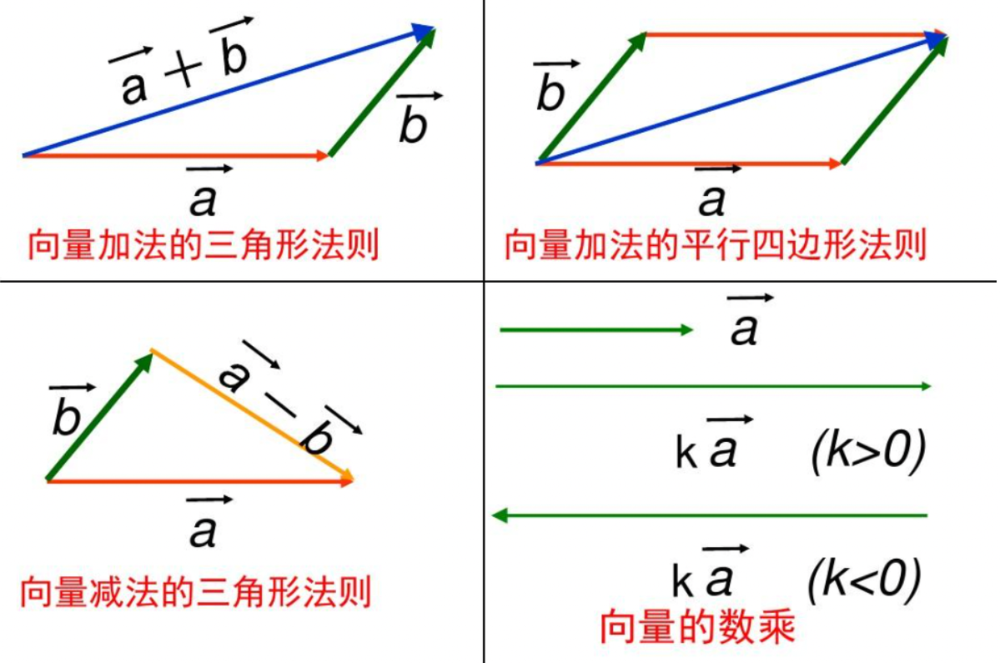
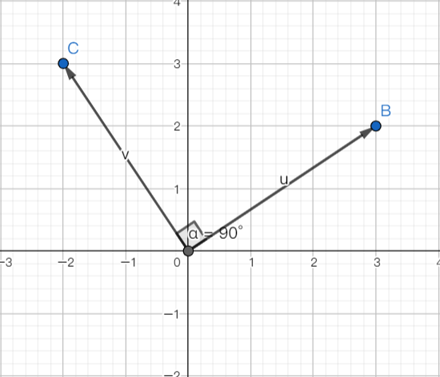
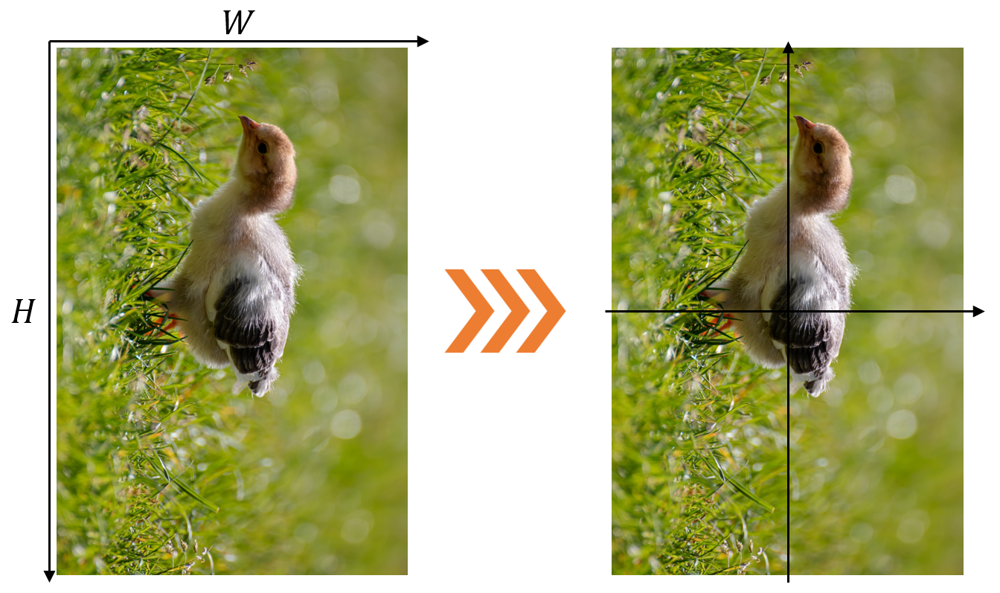
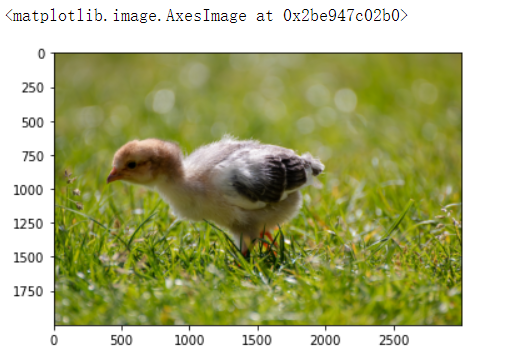

## 线性代数


本节主要讲解了线性代数基础，包括`行列式`、`矩阵`、`向量`、`线性方程组`以及`特征值与特征向量`。最后通过图像旋转demo体会向量矩阵在图像领域的运用。文中涉及的知识都很基础，习题也很简单。主要面向初学者，基础薄弱的入门者。

以下总结本节涉及到`Python`解决线代的代码。


## 1 线性方程组

$$
\left\{\begin{array}{l}
x+y=10\\
2x+4y=28
\end{array}\right.
\Rightarrow
\begin{bmatrix}
{1}\\
{2}\\
\end{bmatrix}
x+\begin{bmatrix}
{1}\\
{4}\\
\end{bmatrix}
y = \begin{bmatrix}
{10}\\
{28}\\
\end{bmatrix}\label{eq*}
$$

```python
import numpy as np 
A = np.array([[1, 1],
              [2, 4]])     # 将系数所有向量拼在一起
b = np.array([10,
              28])  # 常数向量
x = np.linalg.solve(A,b)   # 解线性方程组
print("线性方程组的解为：\n",x)  # [6,4]
```


$$
\left\{\begin{array}{l}
x + y + z = 14 \\
2x+4y + 2z = 40
\end{array}\right.\label{eq2}
$$

```python
A = np.array([[1, 1, 1],
              [2, 4, 2]])     # 将系数所有向量拼在一起
b = np.array([14,
              40])  # 常数向量
x = np.linalg.solve(A,b)   # 解线性方程组
print("线性方程组的解为：\n",x)     # 报错
```

**注意**：上述会报错，因为系数组成的行列式$=$0。

**补充知识**： 非齐次线性方程组的有解充要条件为 他的系数矩阵A和增广矩阵B的秩相等。当$r(A)=r(B)=n(未知量个数)时有唯一解，当r(A)=r(B)<n时有无穷多组解 $


## 2 向量的运算法则

```python
import numpy as np
# 生成向量
x = np.array([1, 2, 3]) # array默认如果只有一列，就是一个向量
y = np.array([4, 5, 6])
print("x={},y={}".format(x, y))
print("x的维度为{}".format(x.shape)) # shape函数用于显示向量的维度，如果是向量默认只有一维，维度显示为(dim,)

# 向量加法
print("x+y = {}".format(x + y))

# 向量数乘
k = 3
print("kx = {}".format(k*x))

print("3x+2y ={} ".format(3*x + 2*y))

#### 以下为输出
x=[1 2 3],y=[4 5 6]
x的维度为(3,)
x+y = [5 7 9]
kx = [3 6 9]
3x+2y =[11 16 21] 
```

我们从几何角度来看这个事情，看看向量的加法与数乘在做什么：




```python
A = np.array([[1, 1, 1],
              [2, 4, 2],
              [2, 2, 2]])

np.linalg.det(A) # 计算方阵A的行列式
print("A的行列式的值为：",np.linalg.det(A))  # A的行列式的值为： 0.0

B = np.array([[1,1,1,1],
              [1,2,0,0],
              [1,0,3,0],
              [1,0,0,4]])
B_det = np.linalg.det(B)
print("B的行列式的值为：",B_det)   # B的行列式的值为： -2.0

# B = np.array([[1,1,1,1],
#               [1,2,0,0],
#               [1,0,0,4]])# 你可以尝试用非方阵计算行列式，压根没法算！
```


有了行列式之后，以后只要我们判断了一个方程组：
1. 未知数个数等于方程的个数
2. 系数行列式$|A| \neq 0$
则这个方程组是有唯一解的.

上面这个判断的法则就是著名的**克莱姆法则(Cramer's Rule)**，更重要的是，克莱姆法则提出了一种解的结构：

设线性方程组的表达式为：$\left\{\begin{array}{c}a_{11} x_{1}+a_{12} x_{2}+\cdots+a_{1 n} x_{n}=b_{1} \\ a_{21} x_{1}+a_{22} x_{2}+\cdots+a_{2 n} x_{n}=b_{2} \\ \cdots \cdots \\ a_{n 1} x_{1}+a_{n 2} x_{2}+\cdots+a_{n n} x_{n}=b_{n}\end{array}\right.$
，系数行列式为：$D = \left|\begin{array}{cccc}a_{11} & a_{12} & \cdots & a_{1 n} \\ a_{21} & a_{22} & \cdots & a_{2 n} \\ \cdots & \cdots & \cdots & \cdots \\ a_{n 1} & a_{n 2} & \cdots & a_{m n}\end{array}\right| \neq 0$，则该线性方程组有且仅有唯一解:

$$
x_{1}=\frac{D_{1}}{D}, x_{2}=\frac{D_{2}}{D}, \cdots, x_{n}=\frac{D_{n}}{D}
$$

其中，$D_{j}=\left|\begin{array}{ccccccc}a_{11} & \cdots & a_{1, j-1} & b_{1} & a_{1, j+1} & \cdots & a_{1 n} \\ a_{21} & \cdots & a_{2, j-1} & b_{2} & a_{2, j+1} & \cdots & a_{2 n} \\ \cdots & \cdots & \cdots & \cdots & \cdots & \cdots & \cdots \\ a_{n 1} & \cdots & a_{n, j-1} & b_{n} & a_{n, j+1} & \cdots & a_{n n}\end{array}\right|$

<div class="alert alert-info" role="alert">


🌰举个例子：
解线性方程组    $\left\{\begin{array}{l}2 x_{1}+x_{2}-5 x_{3}+x_{4}=8 \\ x_{1}-3 x_{2}-6 x_{4}=9 \\ 2 x_{2}-x_{3}+2 x_{4}=-5 \\ x_{1}+4 x_{2}-7 x_{3}+6 x_{4}=0\end{array}\right.$


**解：**方程组的系数行列式
$$
D=\left|\begin{array}{cccc}
2 & 1 & -5 & 1 \\
1 & -3 & 0 & -6 \\
0 & 2 & -1 & 2 \\
1 & 4 & -7 & 6
\end{array}\right|=27 \neq 0
$$
由克莱姆法则知：方程组有唯一解.

$D_{1}=\left|\begin{array}{cccc}8 & 1 & -5 & 1 \\ 9 & -3 & 0 & -6 \\ -5 & 2 & -1 & 2 \\ 0 & 4 & -7 & 6\end{array}\right|=81 \Rightarrow x_{1}=\frac{D_{1}}{D}=\frac{81}{27} = 3$，
$D_{2}=\left|\begin{array}{cccc}2 & 8 & -5 & 1 \\ 1 & 9 & 0 & -6 \\ 0 & -5 & -1 & 2 \\ 1 & 0 & -7 & 6\end{array}\right|=-108 \Rightarrow x_{2}=\frac{D_{2}}{D} =\frac{-108}{27}= 4$，$D_{3}=\left|\begin{array}{cccc}2 & 1 & 8 & 1 \\ 1 & -3 & 9 & -6 \\ 0 & 2 & -5 & 2 \\ 1 & 4 & 0 & 6\end{array}\right|=-27 \Rightarrow x_{3}=\frac{D_{3}}{D} = =\frac{-27}{27}=-1$，$D_{4}=\left|\begin{array}{cccc}2 & 1 & -5 & 8 \\ 1 & -3 & 0 & 9 \\ 0 & 2 & -1 & -5 \\ 1 & 4 & -7 & 0\end{array}\right|=27 \Rightarrow x_{4}=\frac{D_{4}}{D} = \frac{27}{27} = 1$


```python
# 使用python实现克拉默法则：
D = np.array([[2.,1,-5,1],[1,-3,0,-6],[0,2,-1,2],[1,4,-7,6]])
D_det = np.linalg.det(D)

D1 = np.array([[8.,1,-5,1],[9,-3,0,-6],[-5,2,-1,2],[0,4,-7,6]])
D1_det = np.linalg.det(D1)

D2 = np.array([[2.,8,-5,1],[1,9,0,-6],[0,-5,-1,2],[1,0,-7,6]])
D2_det = np.linalg.det(D2)

D3 = np.array([[2.,1,8,1],[1,-3,9,-6],[0,2,-5,2],[1,4,0,6]])
D3_det = np.linalg.det(D3)

D4 = np.array([[2.,1,-5,8],[1,-3,0,9],[0,2,-1,-5],[1,4,-7,0]])
D4_det = np.linalg.det(D4)

x1 = D1_det / D_det
x2 = D2_det / D_det
x3 = D3_det / D_det
x4 = D4_det / D_det
print("克拉默法则解线性方程组的解为：\n x1={:.2f},\n x2={:.2f},\n x3={:.2f},\n x4={:.2f}".format(x1,x2,x3,x4))

# 以下为输出
# 克拉默法则解线性方程组的解为：
# x1=3.00,
# x2=-4.00,
# x3=-1.00,
# x4=1.00
```


## 3 矩阵

```python
A = np.array([[1, 2],
              [1, -1]])
B = np.array([[1, 2, -3],
              [-1, 1, 2]])

print("A的规模{}".format(A.shape))  # (2,2)
print("B的规模{}".format(B.shape))  # (2,3)

# 计算AB
print("AB=\n{}".format(np.matmul(A, B)))  [[-1 4 1],[2 1 -5]]

# 计算BA会报错维度不对应
# np.matmul(B, A)
```

此外，两个维度大小一个矩阵可以做加法，即对应位置元素相加. 一个矩阵乘一个常数等于每个位置的元素都乘这个常数

```python
A = np.array([[1, 2],
              [1, -1]])
C = np.array([[1, 2],
                [3, 4]])
print("A+C = \n", A + C) # A+C 
print("3*A = \n", 3 * A) # 3*A
```


**单位矩阵**

```python
print("B =\n", B,"\n", "E = \n", np.eye(3)) # 3阶单位阵

np.matmul(B, np.eye(3))   
```

初等矩阵代码省略。。。


**检验非奇异矩阵**

```python
import numpy as np

A = np.array([[1, 2], [3, 4]])
print(np.linalg.det(A),"行列式不为0，非奇异阵") # 检验是否奇异   
print("A的逆矩阵：\n", np.linalg.inv(A)) # 矩阵求逆

A_inv = np.linalg.inv(A)  # 求逆矩阵

print("验证AA_inv = E \n", np.matmul(A, A_inv))
```

奇异矩阵：行列式为0的矩阵，不可逆矩阵

这里看着不像单位阵，但实际上是因为数值计算带来的后果，我们仅需要做一下数值过滤即可.事实上，为了一些应用更加简便，对于非奇异阵我们也定义了"伪逆". 它的定义是这样的：对于任意一个矩阵𝐴∈ℝ𝑛×𝑚A∈Rn×m，存在一个矩阵𝐴𝑔∈ℝ𝑚×𝑛Ag∈Rm×n，使得𝐴𝐴𝑔𝐴=𝐴AAgA=A，则称𝐴𝑔Ag为𝐴A的**伪逆**(广义逆).

具体实现如下：

```python
B = np.array([[0, 1],
              [0, -1]])
print(np.linalg.det(B),"行列式为0，奇异阵") # 检验是否奇异  # 0.0 行列式为0，奇异阵
# print("B的逆矩阵：\n", np.linalg.inv(B)) # 直接求逆会报错

print(np.linalg.pinv(B))
print(np.matmul(np.matmul(B, np.linalg.pinv(B)),B)) # 验证广义逆的定义

#######
0.0 行列式为0，奇异阵
[[ 0.   0. ]
 [ 0.5 -0.5]]
[[ 0.  1.]
 [ 0. -1.]]
```


## 4 特征值与特征向量

```python
# 使用python求解矩阵的特征值和特征向量
A = np.array([[-2,1,1],
             [0,2,0],
             [-4,1,3]])
lamb,p = np.linalg.eig(A)  # 特征值与特征向量
print("矩阵A的特征值为：",lamb)
print("矩阵A的特征向量为：\n",p)
print("矩阵A对角化为：\n",np.matmul(np.linalg.inv(p),np.matmul(A,p)))

#######
矩阵A的特征值为： [-1.  2.  2.]
矩阵A的特征向量为：
 [[-0.70710678 -0.24253563  0.30151134]
 [ 0.          0.          0.90453403]
 [-0.70710678 -0.9701425   0.30151134]]
矩阵A对角化为：
 [[-1.00000000e+00 -1.32062993e-16 -3.03478581e-16]
 [-1.60646788e-17  2.00000000e+00 -1.53475516e-17]
 [ 0.00000000e+00  0.00000000e+00  2.00000000e+00]]
```


## 实战案例


我们先来看看每个点是怎么旋转的，首先我们建立一个平面直角坐标系，来观察向量的变换.



我们给定一个向量$u=(3,2)$，将其逆时针旋转$90^{\circ}$，可以得到向量$v=(-2,3)$.

设初始向量$u=(x,y)$，逆时针旋转的角度为$\alpha$. 此时可以推出，
$$
\theta = \arctan{\frac{y}{x}} \\
r = ||u||_2
$$
旋转后得到的坐标为
$$
x' = r\cos{(\theta - \alpha)}\\
y' = r\sin{(\theta - \alpha)}
$$
利用三角和差公式得
$$
\cos{(\theta - \alpha)} = \cos{\theta} \cos{\alpha}+\sin{\theta}\sin{\alpha}\\
\sin{(\theta - \alpha)} = \sin{\theta}\cos{\alpha} - \cos{\theta}\sin{\alpha}
$$
则
$$
\begin{aligned}
x' &= r\cos{\theta} \cos{\alpha}+ r\sin{\theta}\sin{\alpha}\\
&= x \cos{\alpha} + y \sin{\alpha}\\
y' &= r\sin{\theta}\cos{\alpha} - r\cos{\theta}\sin{\alpha}\\
&= y \cos{\alpha} - x \sin{\alpha}  
\end{aligned}
$$

#### 📋任务1

请你根据上式，补全下面矩阵中的问号处 ==TODO==
$$
\left[\begin{array}{lll} 
x' & y' & 1
\end{array}\right]=\left[\begin{array}{lll} 
x  & y  & 1
\end{array}\right]\left[\begin{array}{ccc}
cos{\alpha} & -sin{\alpha} & 0 \\
sin{\alpha} & cos{\alpha} & 0 \\
0 & 0 & 1
\end{array}\right]
$$
同理，我们可以计算得到原坐标$(x,y)$关于变换后坐标的表达式:
$$
\left[\begin{array}{lll}
x & y & 1
\end{array}\right]=\left[\begin{array}{lll}
x' & y' & 1
\end{array}\right]\left[\begin{array}{ccc}
\cos \alpha & \sin \alpha & 0 \\
-\sin \alpha & \cos \alpha & 0 \\
0 & 0 & 1
\end{array}\right]
$$
下面我们来尝试用python实现对二维向量的旋转：

```python
# 在------------位置补全代码
import numpy as np
from math import cos, sin, pi

def vec_2d(x0, y0, alpha):
    """
    旋转2维向量.
    x0: 横坐标.
    y0: 纵坐标.
    alpha: 旋转角度，弧度制.
    return:(x,y) 旋转后的坐标.
    """
    origin = np.array([[x0, y0, 1]])
    Trans = np.array([[cos(alpha), -sin(alpha), 0],
                      [sin(alpha), cos(alpha), 0],
                      [0, 0, 1]])
    
    res =   origin.dot(Trans)
    print(res)
    print(res.shape)
    x = res[0][0]
    y = res[0][1]
    return (x, y)
```

```python
# 运行效果应该如下
vec_2d(3, 2, pi/2)
####
[[ 2. -3.  1.]]
(1, 3)
(2.0, -3.0)
```


但如果这样的话，会出现一个问题，对于一张图片而言，旋转中心在左上角，导致整张图片旋转不是中心旋转的. 下面我们需要对坐标轴进行平移，完善我们的变换公式




假设图片宽度为$W$，高度为$H$，则在第一个坐标系下(左图)的坐标$(x',y')$，变换之后的坐标为$(x'',y'')$，则
$$
\begin{aligned}
x'' &= x'- \frac{1}{2}W \\
y'' &= -y'+ \frac{1}{2}H
\end{aligned}
$$

则对应的矩阵表示为：


#### 📋任务2

请你根据上式，补全下面矩阵中的问号处 ==TODO==

$$
\left[\begin{array}{lll}
x'' & y'' & 1
\end{array}\right]=\left[\begin{array}{lll}
x' & y' & 1
\end{array}\right]\left[\begin{array}{ccc}
1 & 0 & 0 \\
0 & -1 & 0 \\
-0.5W & 0.5H & 1
\end{array}\right]
$$

同理可以求得其逆变换矩阵为：
$$
\left[\begin{array}{lll} 
x _{0} & Y _{0} & 1
\end{array}\right]=\left[\begin{array}{lll} 
x & y & 1
\end{array}\right]\left[\begin{array}{ccc}
1 & 0 & 0 \\
0 & -1 & 0 \\
-0.5 W & 0.5 H & 1
\end{array}\right]
$$
根据图像旋转的一般过程：
1. 将原始图像的坐标系转换为数学坐标系；
2. 通过旋转公式对冬像坐标进行旋转；
3. 将旋转后的数学坐标系转换为图像坐标系.

因此图像旋转的矩阵变换为：
$$
\left[\begin{array}{lll} 
x'' & y'' & 1
\end{array}\right]=\left[\begin{array}{lll} 
x & y & 1
\end{array}\right]\left[\begin{array}{ccc}
1 & 0 & 0 \\
0 & -1 & 0 \\
-0.5 W & 0.5 H & 1
\end{array}\right]\left[\begin{array}{ccc}
\cos \alpha & -\sin \alpha & 0 \\
\sin \alpha & \cos \alpha & 0 \\
0 & 0 & 1
\end{array}\right]\left[\begin{array}{ccc}
1 & 0 & 0 \\
0 & -1 & 0 \\
0.5 W & 0.5H & 1
\end{array}\right]\\
=\left[\begin{array}{lll} 
x & y & 1
\end{array}\right] \left[\begin{array}{ccc}
\cos \alpha & \sin \alpha & 0 \\
-\sin \alpha & \cos \alpha & 0 \\
-0.5 W \cos \alpha +0.5 H \sin \alpha +0.5W & -0.5W \sin \alpha -0.5 H \cos \alpha + 0.5 H & 1
\end{array}\right]
$$

```python
# 图像旋转的矩阵
def Trans(x0, y0, W, H, alpha):
    origin = np.array([[x0, y0, 1]])
    res = origin.dot(np.array([[cos(alpha), sin(alpha), 0],
                     [-sin(alpha), cos(alpha), 0],
                     [-0.5*W*cos(alpha) + 0.5*H*sin(alpha) + 0.5*W, -0.5*W*sin(alpha) - 0.5*H*cos(alpha) + 0.5*H, 1]]))
#     print(res.shape)   # (1,3)
    return (int(res[0,:2][0]),int(res[0,:2][1]))
```

```python
from skimage import io, data
img3 = data.horse()
io.imshow(img3)
print(img3.shape)

img4 = np.zeros((400, 400))

for x in range(img3.shape[0]):
    for y in range(img3.shape[1]):
        x1, y1 = Trans(x, y, 328, 400, pi/2)
        img4[x1-355, y1] = img3[x, y] # 335是做了一步平移居中，保证画面完整性
io.imshow(img4)
```


当然现在Python有很多现成的工具库，可以实现图像旋转的功能，例如`skimage`——一个图像处理库.

#### 📋任务3

下面请你学习使用`skimage`内置函数`transform.rotate`，尝试一键旋转Ginger的农场里的小鸡！

```python
from skimage import io, transform
import matplotlib.pyplot as plt

dirpath = "./figures/2-6.jpg"
img = io.imread(dirpath) #读取数据
plt.imshow(img) 
```


```python
# 在#------------位置补全代码
# 旋转图像
img2 = transform.rotate(img,90, resize=True)  # resize默认为false  如果这里设置为false会导致图像显示不全
plt.imshow(img2) 
```



