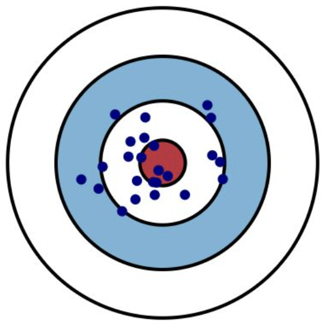
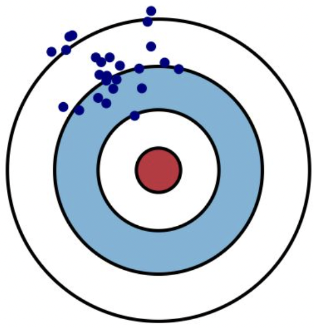
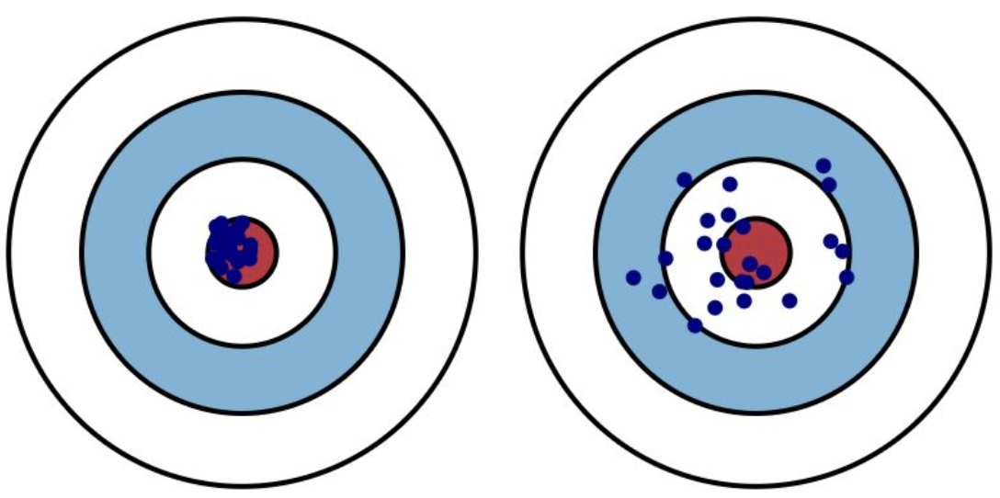

## 数理统计专题


### 相关概念


#### 经验分布函数

设 $x_{1}, x_{2}, \cdots, x_{n}$ 是取自总体分布函数为 $F(x)$ 的样本， 若将样本观测值由小到大进行排列， 记为 $x_{(1)}, x_{(2)}, \cdots, x_{(n)}$, 则 $x_{(1)}, x_{(2)}, \cdots, x_{(n)}$ 称为有序样本， 用有序样本定义如下函数
$$
F_{n}(x)= \begin{cases}0, & \text { 当 } x<x_{(1)}, \\ k / n, & \text { 当 } x_{(k)} \leqslant x<x_{(k+1)}, k=1,2, \cdots, n-1, \\ 1, & \text { 当 } x \geqslant x_{(n)},\end{cases}
$$
则 $F_{n}(x)$ 是一非减右连续函数， 且满足
$$
F_{n}(-\infty)=0 \text { 和 } F_{n}(\infty)=1 .
$$
由此可见， $F_{n}(x)$ 是一个分布函数， 称 $F_{n}(x)$ 为该样本的经验分布函数。

为什么样本信息可以用来推断总体呢？格纹利柯定理给我们指明了一个方向：

设 $x_{1}, x_{2}, \cdots, x_{n}$ 是取自总体分布函数为 $F(x)$ 的样本， $F_{n}(x)$ 是其经验分布函数， 当 $n \rightarrow \infty$ 时， 有
$$
P\left(\sup _{-\infty<x<\infty}\left|F_{n}(x)-F(x)\right| \rightarrow 0\right)=1 
$$
当 $n$ 相当大时，经验分布函数是总体分布函数 $F(x)$ 的一个良好的近似。 因此，在经典统计学中一切统计推断都是以样本为依据推断总体。

**例子**：随机观察总体X, 得到一个容量为 10 的样本:
$$
3.2, \quad 2.5, \quad-2, \quad 2.5, \quad 0,\quad 3,\quad 2 ,\quad 2.5, \quad 2, \quad 4
$$
求 $\mathrm{X}$ 经验分布函数。

解：首先，将样本排序 $-2<0<2=2<2.5=2.5=2.5<3<3.2<4$

于是，根据公式可以得到经验分布函数：
$$
F_{10}(x)=\left\{\begin{array}{cc}
0, & x<-2 \\
1 / 10, & -2 \leq x<0 \\
2 / 10, & 0 \leq x<2 \\
4 / 10, & 2 \leq x<2.5 \\
7 / 10, & 2.5 \leq x<3 \\
8 / 10, & 3 \leq x<3.2 \\
9 / 10, & 3.2 \leq x<4 \\
1, & x \ge 4
\end{array},\right.
$$

#### **样本均值**

设 $x_{1}, x_{2}, \cdots, x_{n}$ 为取自某总体的样本， 其算术平均值称为样本均值，一 般用 $\bar{x}$ 表示，即
$$
\bar{x}=\frac{x_{1}+x_{2}+\cdots+x_{n}}{n}=\frac{1}{n} \sum_{i=1}^{n} x_{i} 
$$
如果把样本中的数据与样本均值的差称为偏差， 则样本所有偏差之和为 0， 即 $\sum_{i=1}^{n}\left(x_{i}-\bar{x}\right)=0$。


从上面的实验可以看到，统计量——样本均值的分布，即**样本均值的抽样分布当n越来越大时近似服从正态分布**，具体来说：

设 $x_{1}, x_{2}, \cdots, x_{n}$ 是来自某个总体的样本， $\bar{x}$ 为样本均值。

（1）若总体分布为 $N\left(\mu, \sigma^{2}\right)$， 则 $\bar{x}$ 的精确分布为 $N\left(\mu, \sigma^{2} / n\right)$;

（2） 若总体分布末知或不是正态分布， $E(x)=\mu, \operatorname{Var}(x)=\sigma^{2}$ 存在， 则 $n$ 较大时 $\bar{x}$ 的渐近分布为 $N\left(\mu, \sigma^{2} / n\right)$。 这里渐近分布是指 $n$ 较大时的近似分布。


#### **样本方差与样本标准差**

设 $x_{1}, x_{2}, \cdots, x_{n}$ 为取自某总体的样本，则它关于样本均值 $\bar{x}$ 的平均偏差平方和
$$
s_{n}^{2}=\frac{1}{n} \sum_{i=1}^{n}\left(x_{i}-\bar{x}\right)^{2}
$$
称为样本方差。

样本标准差就是样本方差的算术平方根，即：$s_{n}=\sqrt{s_{n}^{2}}$。

在实际的应用中，我们往往不会直接使用样本方差，更倾向于使用样本标准差，因为样本方差的量纲（单位）与样本均值不一致，无法与样本均值进行加减运算。实际上，样本标准差可以与均值发生计算关系，表示数据的范围，如：$(\bar{x}-3s_n, \bar{x}+3s_n)$表示数据的范围在样本均值的三个标准差范围，而方差由于量纲不一致做不到与样本均值的联动。

另外，样本方差除了上述的表达式，还有另一个表达式：$s^{2}=\frac{1}{n-1} \sum_{i=1}^{n}\left(x_{i}-\bar{x}\right)^{2}$。$s^{2}$常被称为无偏方差，这里大家只需要知道的就是：==当样本量较大时，$s_n^2$与$s^2$相差不大，可以随意使用，当样本量较小时，计算样本方差最好使用无偏样本方差$s^2$==。


样本方差/样本标准差的分布：

事实上，样本方差/样本标准差的分布并没有像样本均值那样有完美的渐近分布，不同总体下的样本方差/样本标准差的分布都不一样，我们在下一节内容给大家介绍当总体服从正态分布条件下的与样本方差/样本标准差有关的分布，他是三大抽样分布中著名的卡方分布。在这里，我们可以发现如下规律：

设总体为 $X$ 方差存在， 即 $E(X)=\mu, \operatorname{Var}(X)=\sigma^{2}<\infty, x_{1}, x_{2}, \cdots, x_{n}$ 为 从该总体得到的样本， $\bar{x}$ 和 $s^{2}$ 分别是样本均值和样本方差, 则
$$
\begin{gathered}
E(\bar{x})=\mu, \quad \operatorname{Var}(\bar{x})=\sigma^{2} / n, \\
E\left(s^{2}\right)=\sigma^{2} .
\end{gathered}
$$
此定理表明， ==样本均值的期望与总体均值相同， 而样本均值的方差是总体方差的 $1 / n$==。


#### 样本分位数与样本中位数及其抽样分布

在概率论中，我们知道中位数是指累计概率$p=0.5$时对应的随机变量值$x$，而样本抽样后的一组离散个数的取值，因此，我们定义样本中位数只需要查找抽样后的样本中排在中间的那个样品，具体来说：
$$
m_{0.5}= \begin{cases}x\left(\frac{n+1}{2}\right), & n \text { 为奇数, } \\ \left.\frac{1}{2}\left(\frac{x}{2}\right)+x\left(\frac{n}{2}+1\right)\right), & n \text { 为偶数. }\end{cases}
$$
若 $n=5$， 则 $m_{0.5}=x_{(3)}$， 若 $n=6$, 则 $m_{0.5}=\frac{1}{2}\left(x_{(3)}+x_{(4)}\right)$。


#### 卡方统计量与卡方分布

假设$x_1,x_2,...x_n$是标准正态分布$N(0,1)$为总体抽样的得到的样本（$x_1,x_2,...x_n$独立同分布于$N(0,1)$），则
$$
\chi^{2}=x_{1}^{2}+x_{2}^{2}+\cdots+x_{n}^{2}
$$
的分布为自由度为n的$\chi^{2}$分布，简称$\chi^{2} \sim \chi^{2}(n)$，$\chi^{2}$分布的密度函数为：
$$
p(y)=\frac{(1 / 2)^{\frac{n}{2}}}{\Gamma(n / 2)} y^{\frac{n}{2}-1} \mathrm{e}^{-\frac{y}{2}}, \quad y>0
$$
**可以用一句话记住卡方分布：$n$个标准正态分布的平方和服从自由度为$n$的卡方分布**。

有同学可能会问，什么是自由度，这个概念不用深究，可以简单理解为可以自由变化的变量个数。有一个例子很好地阐述了自由度的概念：在无偏样本方差$s^{2}=\frac{1}{n-1} \sum_{i=1}^{n}\left(x_{i}-\bar{x}\right)^{2}$中，为什么分母是$n-1$而不是$n$呢？是因为在这个式子中只有$n-1$个可以自由变化的变量数，$n$个样本，其中在计算样本均值时需要花费一个方程，即$\bar{x}=\frac{x_{1}+x_{2}+\cdots+x_{n}}{n}$，因此样本方差就只剩下$n-1$个自由度了。


### 参数估计

#### 总体矩和中心矩

在学习矩估计的方法前，我们先来看看什么是矩的概念。对于一个随机变量X来说，随机变量X的矩可以分为原点矩和中心矩，具体来说：

设 $X$ 为随机变量， $k$ 为正整数。 如果以下的数学期望都存在， 则称
$$
\mu_{k}=E\left(X^{k}\right)
$$
为 $X$ 的 $k$ 阶原点矩。 称
$$
\nu_{k}=E(X-E(X))^{k}
$$
为 $X$ 的 $k$ 阶中心矩。

显然，数学期望是随机变量的1阶原点矩，方差是随机变量的2阶中心矩。随机变量的矩是随机变量的一类数字特征，随机变量的原点矩刻画了随机变量$X$偏离原点$(0,0)$的程度，而中心矩描述了随机变量$X$偏离“中心”的程度，可以使用数学期望和方差做类比。

与此同时，一类常见的统计量就是样本矩，具体来说：
设 $x_{1}, x_{2}, \cdots, x_{n}$ 是样本， $k$ 为正整数， 则统计量
$$
a_{k}=\frac{1}{n} \sum_{i=1}^{n} x_{i}^{k}
$$
称为样本 $k$ 阶原点矩。 特别地， 样本一阶原点矩就是样本均值。 统计量
$$
b_{k}=\frac{1}{n} \sum_{i=1}^{n}\left(x_{i}-\bar{x}\right)^{k}
$$
称为样本 $k$ 阶中心矩。 特别地， 样本二阶中心矩就是样本方差。


#### 矩估计

1900年，皮尔逊提出了替换原理，具体来说就是：使用样本矩（样本原点矩和样本中心矩）替换总体矩（原点矩和中心矩），如：使用样本均值$\bar{x}$替换总体均值$E(X)$、使用样本方差$s^2$替换总体方差$Var(X)$。

当然，我们也可以拓展下替换原理就是矩估计，如：使用样本均值$\bar{x}$估计总体均值$E(X)$、使用样本方差$s^2$估计总体方差$Var(X)$、用事件的频率估计事件的概率、使用样本分位数估计总体分位数等。

为什么矩估计能够让人接受呢？原因就是格利纹科定理：使用经验分布函数替换总体分布。

【例子】假设总体服从指数分布，其密度函数为
$$
p(x ; \lambda)=\lambda \mathrm{e}^{-\lambda x}, \quad x \geqslant 0
$$
从该总体中抽样1000个样本，估计总体分布的参数$\lambda$。

解：

$k=1$， 由于 $E(X)=1 / \lambda$，即 $\lambda=1 / E(X)$，因此，$\lambda$的矩估计为：$\hat{\lambda}=\frac{1}{\bar{x}} $

```python
# 假设真实值lambda = 5
from scipy.stats import expon
real_lmd = 5
x_i = np.random.exponential(scale=1/real_lmd, size=1000)
print("矩估计为：",1/np.mean(x_i))
```


#### 极大似然估计

极大似然估计的思想非常有意思，充分利用了样本的二重性，即：可以把样本想象成黑盒子，打开前样本是一个随机变量，打开后就是确定的值。具体来说：极大似然估计就是利用已知的样本结果信息，反推最有可能（最大概率）导致这些样本结果出现的模型参数值。下面举例子说明：

假设我们有一个罐子（总体），罐子里有黑白两色球，假设黑球为记为1，白球记为0，球的比例未知，假设黑球的比例为$p$，白球的比例时$1-p$。为了估计总体罐子的参数$p$，我们对总体进行抽样，采样的结果如下：
$$
1, 1, 0, 1, 1, 1, 0, 0, 1, 1
$$
为了使用我们的样本信息估计总体参数$p$，我们计算这组样本出现的概率（似然函数）
$$
\begin{gathered}
P(p) &= p\times p\times (1-p) \times p \times p \times p \times (1-p) \times (1-p) \times p \times p\\
&= p^7 \times (1-p)^3
\end{gathered}
$$
由于不同的$p$会导致样本发生的概率发生改变，可能是“冥冥之中自有天意”，有一股无形的力量迫使我们从总体中采样刚好采到这个样本，因此样本发生的概率应该是最大才对。接下来，我们需要把样本发生的概率最大化：
$$
max_p\quad P(p) = p^7 \times (1-p)^3
$$
由于直接求解$n$个连乘的式子是十分困难的，但是我们比较习惯求解加法的式子，因此可以使用对数把以上的式子$P(p)$简化为连加式子$ln(P(p))$（对数似然函数），即：
$$
ln(P(p)) = 7ln(p) \times 3ln(1-p)
$$
最大值的求解需要使用导数的知识，即导函数为0：
$$
\begin{gathered}
&\frac{d ln(P)}{d p} = 0\\
&\frac{7}{p}-\frac{3}{1-p} = 0\\
&p = 0.7
\end{gathered}
$$
求解的最大值对应的$p=0.7$就是我们所要估计的p。下面我们使用python求解：

```python
# 使用sympy演示极大似然估计的案例
from sympy import *
p = Symbol('p')  #定义总体参数
P_p = p**7*(1-p)**3  # 定义似然函数
lnP_p = ln(P_p) # 化简为对数似然
d_ln_P = diff(lnP_p, p) # 求导函数
p_hat = solve(d_ln_P, p) # 导函数为0
print("p的极大似然估计为：",p_hat)
```


#### 无偏性与有效性

对于同一个总体参数的估计统计量的构造方式多种多样，那么如何评价这些统计量的估计好坏呢？下面给出两个准则，分别是：无偏性和有效性。

**无偏性**

使用某个统计量估计总体参数时，由于样本具有随机性，统计量始终与总体参数有一定的差距，这种差距时而偏大，时而偏小，但是平均起来统计量与总体参数之间的差距为0。可以想像成一个箭靶，箭靶中心是总体参数，我们最想要的就是一击必中靶心，但是由于各种因素，我们每次实际的射击（统计量）与实际靶心有一定的差距，有时射出的箭位于靶心上方，有时射出的箭位于靶心的下方，但是平均起来这种差距会被抵消为0。即：

设 $\hat{\theta}=\hat{\theta}\left(x_{1}, x_{2}, \cdots, x_{n}\right)$ 是 $\theta$ 的一个估计， $\theta$ 的参数空间为 $\Theta$， 若对任意的 $\theta \in \Theta$， 有
$$
E_{\theta}(\hat{\theta})=\theta,
$$
则称 $\hat{\theta}$ 是 $\theta$ 的无偏估计， 否则称为有偏估计。

<div>


</div>

左图代表无偏，右图则是有偏估计。


**有效性**：

对于同一个总体参数的估计统计量的构造方式多种多样，同时对于同一个总体参数的无偏估计也有很多个统计量进行估计，因此如何从众多的无偏估计统计量中选择合适的统计量估计总体参数呢？其实，最直观的方式是：如果该统计量围绕总体分布的参数值波动越小越好，因此波动越小，由于随机性导致的统计量每次估计总体分布参数时不会差别太大。波动可以使用方差来衡量，因此应该选择无偏估计的统计量中方差最小的统计量作为最有效的统计量。具体来说：

设 $\hat{\theta}_{1}, \hat{\theta}_{2}$ 是 $\theta$ 的两个无偏估计， 如果对任意的 $\theta \in \Theta$ 有
$$
\operatorname{Var}\left(\hat{\theta}_{1}\right) \leqslant \operatorname{Var}\left(\hat{\theta}_{2}\right),
$$
且至少有一个 $\theta \in \Theta$ 使得上述不等号严格成立， 则称 $\hat{\theta}_{1}$ 比 $\hat{\theta}_{2}$ 有效。

<div>

</div>

左图的统计量比右图的统计量更有效。


### TODO

此节概念和代码例子很多，以后要从事数理统计的 可以深入学习，初学者了解相关概念，有记忆就行了，等用的时候在回头翻阅。。。


