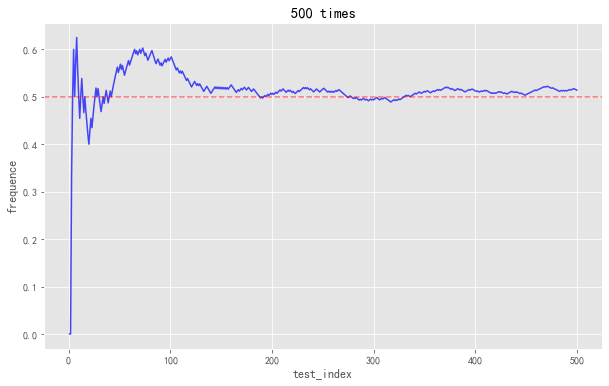
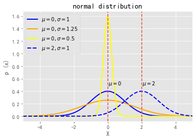
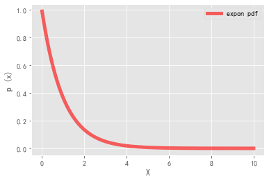
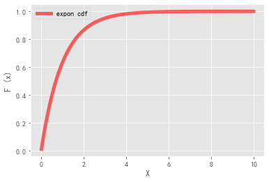
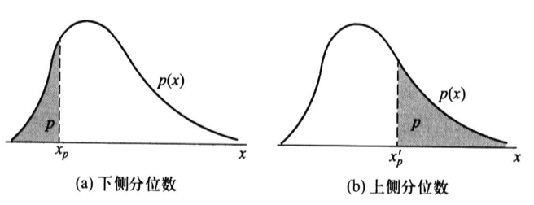
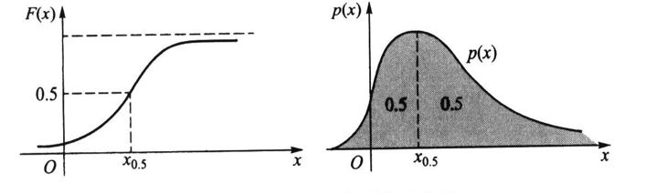
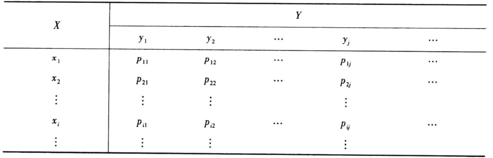
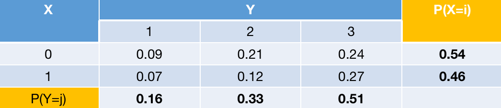
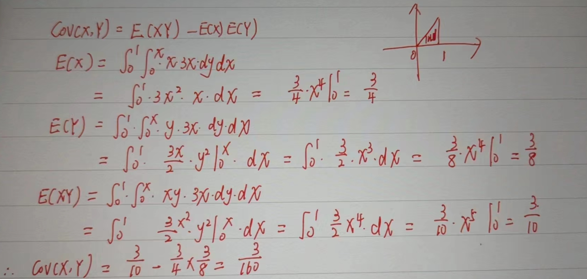

## 概率论


概率论专题：

- 随机现象与概率
- 条件概率、乘法公式、全概率公式与贝叶斯公式
- 一维随机变量及其分布函数和密度函数
- 一维随机变量的数字特征：期望、方差、分位数与中位数
- 多维随机变量及其联合分布、边际分布、条件分布
- 多维随机变量的数字特征：期望向量、协方差与协方差矩阵、相关系数与相关系数矩阵、条件期望
- 随机变量序列的收敛状态：依概率收敛、依分布收敛
- 大数定律
- 中心极限定理
- 数学建模案例分析：投资组合分析


本节涉及的`python`例子：

### 条件概率、乘法公式、全概率公式与贝叶斯公式

```python
# 引入相关工具库
import numpy as np 
import pandas as pd 
import matplotlib.pyplot as plt
%matplotlib inline
plt.style.use("ggplot")
import warnings 
warnings.filterwarnings("ignore")
plt.rcParams['font.sans-serif']=['SimHei','Songti SC','STFangsong']
plt.rcParams['axes.unicode_minus'] = False  # 用来正常显示负号
import seaborn as sns 


# 模拟抛硬币正面的概率是否会越来越接近0.5
import random
def Simulate_coin(test_num):
    random.seed(100)
    coin_list = [1 if (random.random()>=0.5) else 0  for i in range(test_num)]   # 模拟试验结果
    coin_frequence = np.cumsum(coin_list) / (np.arange(len(coin_list))+1)  # 计算正面为1的频率
    plt.figure(figsize=(10,6))
    plt.plot(np.arange(len(coin_list))+1, coin_frequence, c='blue', alpha=0.7)
    plt.axhline(0.5,linestyle='--',c='red',alpha=0.5)
    plt.xlabel("test_index")
    plt.ylabel("frequence")
    plt.title(str(test_num)+" times")
    plt.show()

Simulate_coin(test_num = 500)
Simulate_coin(test_num = 1000)
Simulate_coin(test_num = 5000)
Simulate_coin(test_num = 10000)
```




【例子】三门问题（Monty Hall problem ), 是一个源自博弈论的数学游戏问题, 大致出自美国的 电视游戏节目 Let's Make a Deal。问题的名字来自该节目的主持人蒙提・霍尔 (Monty Hall)。这个游戏的玩法是：参赛者会看见三扇关闭了的门，其中一扇的后面有一辆汽车，选中后面有车的那扇门就可以赢得该汽车, 而另外两扇门后面则各藏有一只山羊。当参赛者选定了一扇门，但未去开启它的时候，节目主持人会开启剩下两扇门的其中一扇, 露出其中一只山羊。主持人其后会问参赛者要不要换另一扇仍然关上的门。问题是：换另一扇门会否增加参赛者赢得汽车的机会率？

解：
   - 在主持人不打开门时, 选手抽中车的概率为 $1 / 3$ 。
   - 假设：$\mathrm{A}=$ 选手选择第一扇门，第一扇门中是车；$B=$ 选手选择第一扇门, 第二扇门中是车；$C=$ 选手选择第一扇门, 第三扇门口中是车； $\mathrm{D}=$ 主持人打开第三扇门。即：
$$
\begin{aligned}
    &P(D \mid A)=1 / 2 \\
    &P(D \mid B)=1 \\
    &P(D \mid C)=0 \\
    &P(A)=P(B)=P(C)=1 / 3\\
    &\text{根据贝叶斯公式：}\\
    &P(D)=P(A) P(D \mid A)+P(B) P(D \mid B)+P(C) P(D \mid C)=1 / 2 \\
    &P(A \mid D)=P(A) P(D \mid A) / P(D)=1 / 3 \\
    &P(B \mid D)=P(B) P(D \mid B) / P(D)=2 / 3
    \end{aligned}
$$

下面，我们使用python代码模拟三门问题：

```python
import random 
class MontyHall:
    def __init__(self,n):
        """
        n : int,试验的次数
        """
        self.n = n
        self.change = 0  # 记录换才能拿到车的次数
        self.No_change = 0  # 记录不换才能拿到车的次数
    def start(self):
        for i in range(self.n):
            door_list = [1,2,3]   ## 三扇门
            challenger_door = random.choice(door_list)   ## 随机选择了其中一扇
            car_door = random.choice(door_list)     ## 随机选定车的门
            door_list.remove(challenger_door)   ## 没有被挑战者选中的剩下的门
            if challenger_door == car_door:
                host_door = random.choice(door_list)
                door_list.remove(host_door)        # 不换才能拿车
                self.No_change += 1
            else:
                self.change += 1      # 换了才能拿车
        print("换且能拿到车的概率：%.2f " % (self.change/self.n * 100) + "%")
        print("不换也能拿到车的概率：%.2f"% (self.No_change/self.n * 100) + "%")

if __name__ == "__main__":
    mh = MontyHall(1000000)
    mh.start()  
```

```
换且能拿到车的概率：66.67 %
不换也能拿到车的概率：33.33%
```


### 一维随机变量及其分布函数和密度函数

**理论部分**

设 $X$ 为一个随机变量,对任意实数 $x$,事件“ $X \leqslant x$ ”的概率 是 $x$ 的函数,记为
$$
F(x)=P(X \leqslant x)
$$
这个函数称为 $X$ 的累积概率分布函数,简称分布函数。为什么要这么设置分布函数呢？原因可以从概率的本质入手，因为分布函数本身就是为了计算随机变量的概率。
   - $ 0 \leqslant F(x) \leqslant 1$ 。 要记住,分布函数值是特定形式事件“ $X \leqslant x$ ”的概率,而 概率总在 0 与 1 之间。
   - $F(-\infty)=\lim _{x \rightarrow-\infty} F(x)=0$ ,这是因为事件“ $X \leqslant-\infty$ "是不可能事件。
   - $F(+\infty)=\lim _{x \rightarrow+\infty} F(x)=1$, 这是因为事件“ $X \leqslant+\infty$ "是必然事件。 
   - $F(x)$ 是非降函数, 即对任意 $x_{1}<x_{2}$, 有 $F\left(x_{1}\right) \leqslant F\left(x_{2}\right)$ 。 这是因为事件 “$ X \leqslant x_{2}$ ”包含事件" $X \leqslant x_{1} $"。

因此：
$$
\begin{aligned}
&P(a<X \leqslant b)=F(b)-F(a) \\
&P(X=a)=F(a)-F(a-0) \\
&P(X \geqslant b)=1-F(b-0) \\
&P(X>b)=1-F(b)\\
&P(X<b)=F(b-0) \\
&P(a<X<b)=F(b-0)-F(a) \\
&P(a \leqslant X \leqslant b)=F(b)-F(a-0) \\
&P(a \leqslant X<b)=F(b-0)-F(a-0)
\end{aligned}
$$

特别当 $F(x)$ 在 $a$ 与 $b$ 处连续时, 有
$$
F(a-0)=F(a), \quad F(b-0)=F(b)
$$
分布函数是计算随机变量表示的随机事件的概率的直接方法，因为分布函数本身就是直接使用概率定义的。现在，我们来看看计算随机变量表示的随机事件的概率的间接方法——密度函数。先来学习连续型随机变量的密度函数，现在不直接假设随机变量的概率函数是什么，我们使用：某个区间内的概率 = 区间长度 * 长度内的概率密度，就好像一个小面积的质量等于面积内的密度 * 面积。因此，概率的计算变成以下的表示：对任意两个实数 $a$ 与 $b$,其中 $a<b$, 且 $a$ 可为 $-\infty, b$ 可为 $+\infty, X$ 在区间 $[a, b]$ 上取值的概率为曲线 $p(x)$ 在该区间上曲边梯形的面积,即
$$
P(a \leqslant X \leqslant b)=\int_{a}^{b} p(x) d x
$$
则称密度函数 $p(x)$ 为连续随机变量 $X$ 的概率分布,或简称 $p(x)$ 为 $X$ 的密度 函数,记为 $X \sim p(x)$, 读作“ $X$ 服从密度 $p(x)$ ”。

由于概率密度函数$P(x)$表示的概率的密度，它应该遵守概率的基本特征（概率最大为1）：
$$
\int_{-\infty}^{\infty} p(x) d x=1 ,\;p(x) \geqslant 0
$$

那与连续随机变量相对应的离散随机变量，它的“密度函数”怎么表示呢？对于离散随机变量来说，我们往往使用分布列去对应连续随机变量密度函数的概念。因为连续随机变量的密度函数使用的是积分来表达的，而离散情况下往往只需要简单的求和就可以了，实际上积分就是符号$\int$就是拉长的求和符号$\sum$他们本质上都是求和。因此，
设 $X$ 是一个离散随机变量,如果 $X$ 的所有可能取值是 $x_{1}, x_{2}, \cdots$, $x_{n}, \cdots$, 则称 $X$ 取 $x_{i}$ 的概率
$$
p_{i}=p\left(x_{i}\right)=P\left(X=x_{i}\right), i=1,2, \cdots, n, \cdots
$$
为 $X$ 的概率分布列或简称为分布列, 记为 $X \sim\left\{p_{i}\right\}$

分布列如下图：
$$
\begin{array}{c|ccccc}
X & x_{1} & x_{2} & \cdots & x_{n} & \cdots \\
\hline P & p\left(x_{1}\right) & p\left(x_{2}\right) & \cdots & p\left(x_{n}\right) & \cdots
\end{array}
$$
例子：柯西分布的分布函数为：$F(x)=\frac{1}{\pi}\left(\arctan x+\frac{\pi}{2}\right),-\infty<x<\infty$，求柯西分布的密度函数？
解：
$$
F^{'}(x) = p(x)=\frac{1}{\pi} \frac{1}{1+x^{2}}, \quad-\infty<x<\infty 
$$

例子：投掷一颗骰子，设$X$为投掷的点数，求随机变量$X$分布列和分布函数。

解：

分布列：
$$
\begin{array}{c|cccccc}
X & 1 & 2 & 3 & 4 & 5 & 6 \\
\hline P & \frac{1}{6} & \frac{1}{6} & \frac{1}{6} & \frac{1}{6} & \frac{1}{6} & \frac{1}{6}
\end{array}
$$

分布函数：
$$
F(x)=P(X \leqslant x) = \begin{cases}0, & x<1 \\ \frac{i}{6}, & i \le x < i+1, i=1,2,3,4,5 \\ 1, & x \ge 6\end{cases}
$$

【例子】如何使用python已知密度函数求分布函数/已知分布函数求密度函数：

```python
## 已知柯西分布的密度函数求分布函数
from sympy import *
x = symbols('x')
p_x = 1/pi*(1/(1+x**2))
integrate(p_x, (x, -oo, x))

## 已知柯西分布的分布函数求密度函数
from sympy import *
x = symbols('x')
f_x = 1/pi*(atan(x)+pi/2)
diff(f_x,x,1)
```

下面介绍常见的连续型随机变量及其密度函数：

#### （1）均匀分布：

一般地，在有限区间 $[a, b]$ 上为常数,在此区间外为零的密度函 数 $p(x)$ 都称为均匀分布,并记为 $U(a, b)$, 其密度函数为
$$
p(x)= \begin{cases}\frac{1}{b-a}, & a \leqslant x \leqslant b \\ 0, & \text { 其它 }\end{cases}
$$
均匀分布的分布函数为：
$$
F(x)= \begin{cases}0, & x<a \\ \frac{x-a}{b-a}, & a \leqslant x<b \\ 1, & x \geqslant b\end{cases}
$$
均匀分布是最简单的，也是最常见的分布，例如：小明去约会，他下午14:00-18:00都**等可能**出现，那么出现的时间点就满足均匀分布。

```python
# 【0，1】上的均匀分布
a = float(0)
b = float(1)

x = np.linspace(a, b)
y = np.full(shape = len(x),fill_value=1/(b - a))  # np.full 构造一个数组，用指定值填充其元素

plt.plot(x,y,"b",linewidth=2)
plt.ylim(0,1.2)
plt.xlim(-1,2)
plt.xlabel('X')
plt.ylabel('p (x)')
plt.title('uniform distribution')
plt.show()
```


#### （2）指数分布：

若随机变量 $X$ 的密度函数为
$$
p(x)=\left\{\begin{aligned}
\lambda e^{-\lambda x}, & x \geqslant 0 \\
0, & x<0
\end{aligned}\right.
$$
则称 $X$ 服从指数分布, 记作 $X \sim \operatorname{Exp}(\lambda)$, 其中参数 $\lambda>0$。其中 $\lambda$ 是根据实际背景而定的正参数。假如某连续随机变量 $X \sim \operatorname{Exp}(\lambda)$, 则表示 $X$ 仅可能取非负实数。

指数分布的分布函数为：
$$
F(x)= \begin{cases}1-\mathrm{e}^{-\lambda x}, & x \geqslant 0 \\ 0, & x<0\end{cases}
$$
实际中不少产品首次发生故障(需要维修)的时间服从指数分布。譬如,某种热水器首次发生故障的时间 $T$ (单位:小时)服从指数分布 $\operatorname{Exp}(0.002)$, 即 $T$ 的密度函数为
$$
p(t)=\left\{\begin{array}{cl}
0.002 e^{-0.002 t}, & t \geqslant 0 \\
0, & t<0
\end{array}\right.
$$

```python
# 指数分布
lam = float(1.5)

x = np.linspace(0,15,100)
y = lam * np.e**(-lam * x)

plt.plot(x,y,"b",linewidth=2) 
plt.xlim(-5,10)
plt.xlabel('X')
plt.ylabel('p (x)')
plt.title('exponential distribution')
plt.show()
```


#### （3）正态分布（高斯分布）

正态分布是《概率论与数理统计》中最重要的一个分布，高斯 (Gauss, 1777-1855)在 研究误差理论时首先用正态分布来刻画误差的分布，所以正态分布又称为高斯分布。

若随机变量 $X$ 的密度函数为
$$
p(x)=\frac{1}{\sqrt{2 \pi} \sigma} \mathrm{e}^{-\frac{(x-\mu)^{2}}{2 \sigma^{2}}}, \quad-\infty<x<\infty,
$$
则称 $X$ 服从正态分布， 称 $X$ 为正态变量， 记作 $X \sim N\left(\mu, \sigma^{2}\right)$。 其中参数 $-\infty<\mu<\infty, \sigma>0$。

```python
## 已知正态分布的密度函数求分布函数
from sympy import *
from sympy.abc import mu,sigma
x = symbols('x')
p_x = 1/(sqrt(2*pi)*sigma)*E**(-(x-mu)**2/(2*sigma**2))
integrate(p_x, (x, -oo, x))
```


```python
#正态分布
import math
mu = float(0)
mu1 = float(2)
sigma1 = float(1)
sigma2 = float(1.25)*float(1.25)
sigma3 = float(0.25)
x = np.linspace(-5, 5, 1000)
y1 = np.exp(-(x - mu)**2 / (2 * sigma1**2)) / (math.sqrt(2 * math.pi) * sigma1)
y2 = np.exp(-(x - mu)**2 / (2 * sigma2**2)) / (math.sqrt(2 * math.pi) * sigma2)
y3 = np.exp(-(x - mu)**2 / (2 * sigma3**2)) / (math.sqrt(2 * math.pi) * sigma3)
y4 = np.exp(-(x - mu1)**2 / (2 * sigma1**2)) / (math.sqrt(2 * math.pi) * sigma1)
plt.plot(x,y1,"b",linewidth=2,label=r'$\mu=0,\sigma=1$') 
plt.plot(x,y2,"orange",linewidth=2,label=r'$\mu=0,\sigma=1.25$') 
plt.plot(x,y3,"yellow",linewidth=2,label=r'$\mu=0,\sigma=0.5$') 
plt.plot(x,y4,"b",linewidth=2,label=r'$\mu=2,\sigma=1$',ls='--') 
plt.axvline(x=mu,ls='--')
plt.text(x=0.05,y=0.5,s=r'$\mu=0$')
plt.axvline(x=mu1,ls='--')
plt.text(x=2.05,y=0.5,s=r'$\mu=2$')
plt.xlim(-5,5)
plt.xlabel('X')
plt.ylabel('p (x)')
plt.title('normal distribution')
plt.legend()
plt.show()
```



- 如果固定 𝜎σ， 改变 𝜇μ 的值，则图形沿 𝑥x 轴平移。也就是说正态密度函数的位置由参数 𝜇μ 所确定， 因此亦称 𝜇μ 为位置参数。
- 如果固定 𝜇μ， 改变 𝜎σ 的值，则分布的位置不变,但 𝜎σ 愈小，曲线呈高而瘦，分布较为集中; 𝜎σ 愈大，曲线呈矮而胖， 分布较为分散。也就是说正态密度函数的尺度由参数 𝜎σ 所确定， 因此称 𝜎σ 为尺度参数。

```python
# 使用scipy计算pdf画图(非自定义函数)
from scipy.stats import expon # 指数分布
x = np.linspace(0.01,10,1000)  
plt.plot(x, expon.pdf(x),'r-', lw=5, alpha=0.6, label='expon pdf')    # pdf表示求密度函数值
plt.xlabel("X")
plt.ylabel("p (x)")
plt.legend()
plt.show()
```



```python
# 使用scipy计算cdf画图(非自定义函数)
from scipy.stats import expon
x = np.linspace(0.01,10,1000)  
plt.plot(x, expon.cdf(x),'r-', lw=5, alpha=0.6, label='expon cdf')  # cdf表示求分布函数值
plt.xlabel("X")
plt.ylabel("F (x)")
plt.legend()
plt.show()
```




下面介绍常见的离散型随机变量及其分布列：

#### （1）0-1分布（伯努利分布）：

满足相互独立、只取两个值的随机变量通常称为伯努利（Bernoulli）随机变量。进行一次事件试验，该事件发生的概率为$p$，不发生的概率为$1-p$。这是一个最简单的分布，任何一个只有两种结果的随机现象都服从0-1分布。
$$
P\{X=k\}=p^{k}(1-p)^{1-k}
$$
其中 $k=0,1$ 。

我们也可以写成分布列的表格形式：
$$
\begin{array}{c|cccccc}
X & 0 & 1  \\
\hline P & p & 1-p 
\end{array}
$$

#### （2）二项分布：

用 $B_{n, k}$ 表示事件“ $n$ 重伯努里试验中成功出现 $k$ 次”。如今我们用随机变量来表示这个事件。设 $X$ 为 $n$ 重伯努里试验中成功的次数,则有 $B_{n, k}=$ “$ X=k $” 。其中 $X$ 可能取的值为 $0,1, \cdots, n$, 它取这些值的概率为
$$
P(X=x)=\left(\begin{array}{l}
n \\
x
\end{array}\right) p^{x}(1-p)^{n-x}, \quad x=0,1, \cdots, n
$$

例子：某特效药的临床有效率为 $0.95$， 今有 10 人服用， 问至少有 8 人治愈的概率是多少？

解：解 设 $X$ 为 10 人中被治愈的人数， 则 $X \sim b(10,0.95)$， 而所求概率为
$$
\begin{aligned}
P(X \geqslant 8) &=P(X=8)+P(X=9)+P(X=10) \\
&=\left(\begin{array}{c}
10 \\
8
\end{array}\right) 0.95^{8} 0.05^{2}+\left(\begin{array}{c}
10 \\
9
\end{array}\right) 0.95^{9} 0.05+\left(\begin{array}{c}
10 \\
10
\end{array}\right) 0.95^{10} \\
&=0.0746+0.3151+0.5987=0.9884 .
\end{aligned}
$$
10 人中至少有 8 人被治愈的概率为 $0.9884$。

#### （3）泊松分布：

泊松分布是 1837 年由法国数学家泊松 (Poisson, 1781-1840)首次提出的，泊松分布的分布列为：
$$
P(X=x)=\frac{\lambda^{x}}{x !} e^{-\lambda}
$$
其中： $\lambda>0$ 是常数，是区间事件发生率的均值。泊松分布是一种常用的离散分布, 它常与单位时间 (或单位面积、单位产品等)上 的计数过程相联系, 譬如,
   - 在一天内，来到某商场的顾客数。（$\lambda$就是单位时间内商场的顾客数）
   - 在单位时间内，一电路受到外界电磁波的冲击次数。
   - 1 平方米内， 玻璃上的气泡数。
   - 一铸件上的砂眼数。
   - 在一定时期内， 某种放射性物质放射出来的 $\alpha$-粒子数， 等等。 

以上的例子都服从泊松分布。 因此泊松分布的应用面是十分广泛的。

```python
# 对比不同的lambda对泊松分布的影响
import math
# 构造泊松分布列的计算函数
def poisson(lmd,x):
    return pow(lmd,x)/math.factorial(x)*math.exp(-lmd)
x = [i+1 for i in range(10)]
lmd1 = 0.8
lmd2 = 2.0
lmd3 = 4.0
lmd4 = 6.0
p_lmd1 = [poisson(lmd1,i) for i in x]
p_lmd2 = [poisson(lmd2,i) for i in x]
p_lmd3 = [poisson(lmd3,i) for i in x]
p_lmd4 = [poisson(lmd4,i) for i in x]

plt.scatter(np.array(x), p_lmd1, c='b',alpha=0.7)
plt.axvline(x=lmd1,ls='--')
plt.text(x=lmd1+0.1,y=0.1,s=r"$\lambda=0.8$")
plt.ylim(-0.1,1)
plt.xlabel("X")
plt.ylabel("p (x)")
plt.title(r"$\lambda = 0.8$")
plt.show()

plt.scatter(np.array(x), p_lmd2, c='b',alpha=0.7)
plt.axvline(x=lmd2,ls='--')
plt.text(x=lmd2+0.1,y=0.1,s=r"$\lambda=2.0$")
plt.ylim(-0.1,1)
plt.xlabel("X")
plt.ylabel("p (x)")
plt.title(r"$\lambda = 2.0$")
plt.show()

plt.scatter(np.array(x), p_lmd3, c='b',alpha=0.7)
plt.axvline(x=lmd3,ls='--')
plt.text(x=lmd3+0.1,y=0.1,s=r"$\lambda=4.0$")
plt.ylim(-0.1,1)
plt.xlabel("X")
plt.ylabel("p (x)")
plt.title(r"$\lambda = 4.0$")
plt.show()

plt.scatter(np.array(x), p_lmd4, c='b',alpha=0.7)
plt.axvline(x=lmd4,ls='--')
plt.text(x=lmd4+0.1,y=0.1,s=r"$\lambda=6.0$")
plt.ylim(-0.1,1)
plt.xlabel("X")
plt.ylabel("p (x)")
plt.title(r"$\lambda = 6.0$")
plt.show()
```

- 位于 𝜆λ （均值）附近概率较大.
- 随着 𝜆λ 的增加, 分布逐渐趋于对称.


```python
# 使用scipy的pmf和cdf画图
from scipy.stats import binom
n=10
p = 0.5
x=np.arange(1,n+1,1)
pList=binom.pmf(x,n,p)
plt.plot(x,pList,marker='o',alpha=0.7,linestyle='None')
'''
vlines用于绘制竖直线(vertical lines),
参数说明：vline(x坐标值, y坐标最小值, y坐标值最大值)
'''
plt.vlines(x, 0, pList)
plt.xlabel('随机变量：抛硬币10次')
plt.ylabel('概率')
plt.title('二项分布：n=%d,p=%0.2f' % (n,p))
plt.show()
```


### 一维随机变量的数字特征：期望、方差、分位数与中位数


#### （1）数学期望（均值）：

“期望”在日常生活中常指有根据的希望,或发生可能性较大的希望。譬如，一位人寿保险经纪人告诉我们:“ 40 岁的妇女可期望再活 38 年。” 这不是说 40 岁的美国妇女都活到 78 岁,然后第二天立刻去世,而是指 40 岁的妇女中,有些可再活 20 年,有些再活 50 年,平均可再活 38 年,即再活 38 年 左右(如再活 $38 \pm 10$ 年)的可能性大一些; 又如,“某种轮胎可期望行驶 6 万公里”,也是指此种轮胎平均可行驶 6 万公里,就个别轮胎来说,有的行驶可超过 6 万公里,有的行驶可能不到 6 万公里就报废,而行驶 6 万公里左右的可能性大一些。因此，下面谈及的“数学期望”是指用概率分布算得的一种加权平均。

离散型随机变量的数学期望：

设**离散随机变量** $X$ 的分布列为
$$
P=\left(X=x_{i}\right)=p\left(x_{i}\right), \quad i=1,2, \cdots, n
$$
则：
$$
E(X)=\sum_{i=1}^{n} x_{i} p\left(x_{i}\right)
$$

连续型随机变量的数学期望：

设**连续随机变量** $X$ 有密度函数 $p(x)$, 如果积分
$$
\int_{-\infty}^{\infty}|x| p(x) d x
$$
有限,则称
$$
E(X)=\int_{-\infty}^{\infty} x p(x) d x
$$
为 $X$ 的数学期望,简称期望,期望值或均值。如果积分无限,则说 $X$ 的数学期望不存在。

数学期望的理论意义是深刻的, 它是消除随机性的主要手段！

例子：以 $X$ 记一张彩票的奖金额，则 $X$ 的分布列如下：
$$
\begin{array}{c|cccccccc}
\hline X & 500000 & 50000 & 5000 & 500 & 50 & 10 & 0 \\
\hline P & 0.000001 & 0.000009 & 0.00009 & 0.0009 & 0.009 & 0.09 & 0.9 & \\
\hline
\end{array}
$$
求一张彩票的平均所得奖金？

解：
$$
E(X)=0.5+0.45+0.45+0.45+0.45+0.9+0=3.2
$$

假设每张福利彩票售价5元，每售出100万张就开一次奖，那么每一次开奖就会把筹得的500万中的320万（$3.2 \times 1000000 = 3200000$）以奖金的形式返还给彩民，剩下的180万则用于福利事业和管理费用，这也是福利彩票的原理。

例子：设 $X$ 服从区间 $(a, b)$ 上的均匀分布，求 $E(X)$。

解：$X$ 的密度函数为：
$$
p(x)=\left\{\begin{array}{cl}
\frac{1}{b-a}, & a<x<b, \\
0, & \text { 其他. }
\end{array}\right.
$$
所以
$$
E(X)=\int_{a}^{b} x \cdot \frac{1}{b-a} \mathrm{~d} x=\left.\frac{1}{b-a} \cdot \frac{x^{2}}{2}\right|_{a} ^{b}=\frac{a+b}{2} .
$$
这个结果是可以理解的，因为 $X$ 在区间 $(a, b)$ 上的取值是均匀的，所以它的平均取值当然应该是 $(a, b)$ 的 “中点”, 即 $(a+b) / 2$。

数学期望的性质：
   - 若 $c$ 是常数， 则 $E(c)=c$。
   - 对任意常数 $a$， 有$E(a X)=a E(X)$。
   - 设 $(X, Y)$ 是二维随机变量, 则有$E(X+Y)=E(X)+E(Y)$
   - **若随机变量 $X$ 与 $Y$ 相互独立**, 则有$E(X Y)=E(X) E(Y) $


**下面给出常见的分布的数学期望：**
   - 0-1分布：$E(X)=p$
   - 二项分布：$E(X) = np$
   - 泊松分布：$E(X) = \lambda$
   - 均匀分布：$E(X) = \frac{a+b}{2}$
   - 正态分布：$E(X) = \mu$
   - 指数分布：$E(X) = \frac{1}{\lambda}$


#### （2）方差与标准差：

随机变量 $X$ 的数学期望 $E(X)$ 是分布的一种**位置特征数**， 它刻画了 $X$ 的取值总在 $E(X)$ 周围波动。但这个位置特征数无法反映出随机变量取值的“波动大小”，譬如 $X$ 与 $Y$ 的分布列分别为：
$$
\begin{array}{c|ccc}
X & -1 & 0 & 1 \\
\hline P & 1 / 3 & 1 / 3 & 1 / 3
\end{array}
$$
与
$$
\begin{array}{c|ccc}
Y & -10 & 0 & 10 \\
\hline P & 1 / 3 & 1 / 3 & 1 / 3
\end{array}
$$
尽管它们的数学期望都是 0 ， 但显然 $Y$ 取值的波动要比 $X$ 取值的波动大。 如何用数值来 反映随机变量取值的“波动”大小，方差与标准差是一个不错的衡量指标。

方差在金融中扮演着重要的作用，就拿刚刚的明天的股票价格这个随机变量来说，如果明天的股价波动较大，往往代表着明天的股价不稳定程度高，风险大，即使明天的股价期望比今天要高，也不会选择买入股票，因为很有可能股价会比今天低而导致损失。因此，方差是衡量随机变量波动程度的数学量，具体的：数学期望 $E(X)$ 是分布的位置特征数，它总位于分布的中心，随机变量 $X$ 的取值总在其周围波动。方差是度量此种波动大小的最重要的特征数。


若随机变量 $X^{2}$ 的数学期望 $E\left(X^{2}\right)$ 存在， 则称偏差平方 $(X-E(X))^{2}$ 的数学期望 $E(X-E(X))^{2}$ 为随机变量 $X$ (或相应分布) 的方差， 记为：
$$
\operatorname{Var}(X)=E(X-E(X))^{2}
$$

离散型随机变量的方差：
$$
\sum_{i}\left(x_{i}-E(X)\right)^{2} p\left(x_{i}\right)
$$
连续型随机变量的方差：
$$
\int_{-\infty}^{\infty}(x-E(X))^{2} p(x) \mathrm{d} x
$$
方差的正平方根 $[\operatorname{Var}(X)]^{1 / 2}$ 称为随机变量 $X($ 或相应分布 $)$ 的标准差,记为 $\sigma_{X}$ 或 $\sigma(X)$ 。

例子：某人有一笔资金， 可投人两个项目： 房地产和商业, 其收益都与市场状态有关。 若把末来市场划分为好、中、差三个等级， 其发生的概率分别为 $0.2 、 0.7 、 0.1$。 通过调查，该投资者认为投资于房地产的收益 $X$ (万元) 和投资于商业的收益 $Y($ 万元) 的分布分别为：
$$
\begin{array}{c|ccc}
X & 11 & 3 & -3 \\
\hline P & 0.2 & 0.7 & 0.1
\end{array}
$$
与
$$
\begin{array}{c|ccc}
Y & 6 & 4 & -1 \\
\hline P & 0.2 & 0.7 & 0.1
\end{array}
$$
解：先来看看平均收益（数学期望）：
$$
\begin{aligned}
&E(X)=11 \times 0.2+3 \times 0.7+(-3) \times 0.1=4.0 \text { (万元 }) \\
&E(Y)=6 \times 0.2+4 \times 0.7+(-1) \times 0.1=3.9(\text { 万元 }) 
\end{aligned}
$$
显然，投资房地产的收益比投资商业的收益大，大约平均大0.1万元。下面来计算各自投资的风险（方差/标准差）：

方差：
$$
\begin{gathered}
\operatorname{Var}(X)=(11-4)^{2} \times 0.2+(3-4)^{2} \times 0.7+(-3-4)^{2} \times 0.1=15.4 \\
\operatorname{Var}(Y)=(6-3.9)^{2} \times 0.2+(4-3.9)^{2} \times 0.7+(-1-3.9)^{2} \times 0.1=3.29
\end{gathered}
$$
标准差：
$$
\sigma(X)=\sqrt{15.4}=3.92, \sigma(Y)=\sqrt{3.29}=1.81
$$
由于标准差越大，说明投资的收益波动越大，那么风险也就越大。虽然投资房地产的平均收益比投资商业的平均收益大0.1万元，但是前者风险却是后者的两倍大，如果综合衡量收益与风险，还是投资商业为妙。

方差的性质：
   - 最重要的性质：$\operatorname{Var}(X)=E\left(X^{2}\right)-[E(X)]^{2}$
   - 常数的方差为 0 ， 即 $\operatorname{Var}(c)=0$， 其中 $c$ 是常数。
   - 若 $a, b$ 是常数，则 $\operatorname{Var}(a X+b)=a^{2} \operatorname{Var}(X)$。
   - 若随机变量 $X$ 与 $Y$ 相互独立， 则有$\operatorname{Var}(X \pm Y)=\operatorname{Var}(X)+\operatorname{Var}(Y) $

常见分布的方差：
   - 0-1分布：$Var(X) = p(1-p)$
   - 二项分布：$Var(X) = np(1-p)$
   - 泊松分布：$Var(X) = \lambda$
   - 均匀分布：$Var(X) = \frac{(b-a)^{2}}{12}$
   - 正态分布：$Var(X) = \sigma^2$
   - 指数分布：$Var(X) = \frac{1}{\lambda^{2}}$

```python
# 使用scipy计算常见分布的均值与方差：(如果忘记公式的话直接查，不需要查书了)
from scipy.stats import bernoulli   # 0-1分布
from scipy.stats import binom   # 二项分布
from scipy.stats import poisson  # 泊松分布
from scipy.stats import rv_discrete # 自定义离散随机变量
from scipy.stats import uniform # 均匀分布
from scipy.stats import expon # 指数分布
from scipy.stats import norm # 正态分布
from scipy.stats import rv_continuous  # 自定义连续随机变量

print("0-1分布的数字特征：均值:{}；方差:{}；标准差:{}".format(bernoulli(p=0.5).mean(), 
                                  bernoulli(p=0.5).var(), 
                                  bernoulli(p=0.5).std()))
print("二项分布b(100,0.5)的数字特征：均值:{}；方差:{}；标准差:{}".format(binom(n=100,p=0.5).mean(), 
                                  binom(n=100,p=0.5).var(), 
                                  binom(n=100,p=0.5).std()))
## 模拟抛骰子的特定分布
xk = np.arange(6)+1
pk = np.array([1.0/6]*6)
print("泊松分布P(0.6)的数字特征：均值:{}；方差:{}；标准差:{}".format(poisson(0.6).mean(), 
                                  poisson(0.6).var(), 
                                  poisson(0.6).std()))
print("特定离散随机变量的数字特征：均值:{}；方差:{}；标准差:{}".format(rv_discrete(name='dice', values=(xk, pk)).mean(), 
                                  rv_discrete(name='dice', values=(xk, pk)).var(), 
                                  rv_discrete(name='dice', values=(xk, pk)).std()))
print("均匀分布U(1,1+5)的数字特征：均值:{}；方差:{}；标准差:{}".format(uniform(loc=1,scale=5).mean(), 
                                  uniform(loc=1,scale=5).var(), 
                                  uniform(loc=1,scale=5).std()))
print("正态分布N(0,0.0001)的数字特征：均值:{}；方差:{}；标准差:{}".format(norm(loc=0,scale=0.01).mean(), 
                                  norm(loc=0,scale=0.01).var(), 
                                  norm(loc=0,scale=0.01).std()))

lmd = 5.0  # 指数分布的lambda = 5.0
print("指数分布Exp(5)的数字特征：均值:{}；方差:{}；标准差:{}".format(expon(scale=1.0/lmd).mean(), 
                                  expon(scale=1.0/lmd).var(), 
                                  expon(scale=1.0/lmd).std()))

## 自定义标准正态分布
class gaussian_gen(rv_continuous):
    def _pdf(self, x): # tongguo 
        return np.exp(-x**2 / 2.) / np.sqrt(2.0 * np.pi)
gaussian = gaussian_gen(name='gaussian')
print("标准正态分布的数字特征：均值:{}；方差:{}；标准差:{}".format(gaussian().mean(), 
                                  gaussian().var(), 
                                  gaussian().std()))

## 自定义指数分布
import math
class Exp_gen(rv_continuous):
    def _pdf(self, x,lmd):
        y=0
        if x>0:
            y = lmd * math.e**(-lmd*x)
        return y
Exp = Exp_gen(name='Exp(5.0)')
print("Exp(5.0)分布的数字特征：均值:{}；方差:{}；标准差:{}".format(Exp(5.0).mean(), 
                                  Exp(5.0).var(), 
                                  Exp(5.0).std()))

## 通过分布函数自定义分布
class Distance_circle(rv_continuous):                 #自定义分布xdist
    """
    向半径为r的圆内投掷一点，点到圆心距离的随机变量X的分布函数为:
    if x<0: F(x) = 0;
    if 0<=x<=r: F(x) = x^2 / r^2
    if x>r: F(x)=1
    """
    def _cdf(self, x, r):                   #累积分布函数定义随机变量
        f=np.zeros(x.size)                  #函数值初始化为0
        index=np.where((x>=0)&(x<=r))           #0<=x<=r
        f[index]=((x[index])/r[index])**2       #0<=x<=r
        index=np.where(x>r)                     #x>r
        f[index]=1                              #x>r
        return f
dist = Distance_circle(name="distance_circle")
print("dist分布的数字特征：均值:{}；方差:{}；标准差:{}".format(dist(5.0).mean(), 
                                  dist(5.0).var(), 
                                  dist(5.0).std()))
```


#### （3）分位数与中位数：

一般来说，分位数和中位数的讨论往往是基于连续型随机变量来说的，因为离散型随机变量的某个概率对应的分位数和中位数有可能不唯一或者不存在。那么什么是分位数呢？分位数和数学期望一样，都是描述随机变量的位置的数字特征，我们把累计概率等于p所对应的随机变量取值x为p分位数，具体是：

设连续随机变量 $X$ 的分布函数为 $F(x)$，密度函数为 $p(x)$。 对任意 $p \in(0,1)$， 称满足条件
$$
F\left(x_{p}\right)=\int_{-\infty}^{x_{p}} p(x) \mathrm{d} x=p
$$
的 $x_{p}$ 为此分布的 $p$ 分位数， 又称下侧 $p$ 分位数。




分位数与上侧分位数是可以相互转换的， 其转换公式如下：
$$
x_{p}^{\prime}=x_{1-p}, \quad x_{p}=x_{1-p}^{\prime} 
$$

**中位数就是p=0.5时的分位数点**，具体为：

设连续随机变量 $X$ 的分布函数为 $F(x)$， 密度函数为 $p(x)$。 称 $p=0.5$ 时的 $p$ 分位数 $x_{0.5}$ 为此分布的中位数，即 $x_{0.5}$ 满足
$$
F\left(x_{0.5}\right)=\int_{-\infty}^{x_{0.5}} p(x) \mathrm{d} x=0.5
$$



数学期望与中位数都是属于位置特征数，但是有时候中位数可能比期望更能说明问题。假如某个城市的平均薪资为5000，中位数薪资为4000，那么能说明有一半的人收入少于4000而有一般大于等于4000。但是平均薪资却有5000，说明了有相当一部分的高收入人群拉高了收入均数，该城市的薪资差异较大。一般来说，均值与中位数相差不大往往能代表系统的结构是正常的，如果偏离较大，则说明系统内结构出现了偏离。中位数往往比均值更加稳健，因为不容易受到极端数据的影响，但是中位数计算比较麻烦，接受起来也比较麻烦；均值会受到极端数据的影响，但是计算简单，也容易接受。

【例子】使用python计算标准正态分布的0.25，0.5（中位数），0.75，0.95分位数点。

```python
from scipy.stats import norm
print("标准正态分布的0.25分位数：",norm(loc=0,scale=1).ppf(0.25))   # 使用ppf计算分位数点
print("标准正态分布的0.5分位数：",norm(loc=0,scale=1).ppf(0.5))
print("标准正态分布的0.75分位数：",norm(loc=0,scale=1).ppf(0.75))
print("标准正态分布的0.95分位数：",norm(loc=0,scale=1).ppf(0.95))
```


### 多维随机变量及其联合分布、边际分布、条件分布


若随机变量 $X_{1}(\omega), X_{2}(\omega), \cdots, X_{n}(\omega)$ 定义在同一个基本空间 $\Omega=\{\omega\}$ 上， 则称
$$
\boldsymbol{X}(\omega)=\left(X_{1}(\omega), X_{2}(\omega), \cdots, X_{n}(\omega)\right)
$$
是一个多维随机变量，也称为n维随机向量。

#### （1.1）n维随机变量的联合分布函数：

一维随机变量的分布函数是一个关于x的函数，而n维随机变量的联合分布函数就是关于n个自变量的函数：

设 $X=\left(X_{1}, X_{2}, \cdots, X_{n}\right)$ 是 $n$ 维随机变量， 对任意 $n$ 个实数 $x_{1}, x_{2}, \cdots, x_{n}$ 所组成的 $n$ 个事件 $X_{1} \leqslant x_{1},X_{2} \leqslant x_{2} , \cdots, X_{n} \leqslant x_{n} $ 同时发生的概率
$$
F\left(x_{1}, x_{2}, \cdots, x_{n}\right)=P\left(X_{1} \leqslant x_{1}, X_{2} \leqslant x_{2}, \cdots, X_{n} \leqslant x_{n}\right)
$$
称为 $n$ 维随机变量 $\boldsymbol{X}$ 的联合分布函数。

#### （1.2）多维连续随机变量的联合密度函数：

一维随机变量的密度函数是通过分布函数来确定的，也就是分布函数是密度函数的积分，那推广至多维随机变量也是如此：

设二维随机变量 $(X, Y)$ 的分布函数为 $F(x, y)$ 。假如各分量 $X$ 和 $Y$ 都是一维连续随机变量，并存在定义在平面上的非负函数 $p(x, y)$，使得
$$
F(x, y)=\int_{-\infty}^{x} \int_{-\infty}^{y} p(x, y) d x d y
$$
则称 $(X, Y)$ 为二维连续随机变量，$p(x, y)$ 称为 $(X, Y)$ 的联合概率密度函数， 或简称联合密度。

在 $F(x, y)$ 偏导数存在的点上有
$$
p(x, y)=\frac{\partial^{2}}{\partial x \partial y} F(x, y) 
$$

#### （1.3）多维离散随机变量的联合分布列：

如果二维随机变量 $(X, Y)$ 只取有限个或可列个数对 $\left(x_{i}, y_{j}\right)$， 则称 $(X, Y)$ 为二维离散随机变量， 称
$$
p_{i j}=P\left(X=x_{i}, Y=y_{j}\right), \quad i, j=1,2, \cdots
$$
为 $(X, Y)$ 的联合分布列， 也可用如下表格形式记联合分布列：




例子：从 $1,2,3,4$ 中任取一数记为 $X$， 再从 $1,2, \cdots, X$ 中任取一数记为 $Y$。 求 $(X, Y)$ 的联合分布列及 $P(X=Y)$。

解:

$$
P(X=Y)=p_{11}+p_{22}+p_{33}+p_{44}=\frac{1}{4}+\frac{1}{8}+\frac{1}{12}+\frac{1}{16}=\frac{25}{48}=0.5208
$$

```python
# 绘制二维正态分布的联合概率密度曲面图
from scipy.stats import multivariate_normal
from mpl_toolkits.mplot3d import axes3d
x, y = np.mgrid[-5:5:.01, -5:5:.01]  # 返回多维结构
pos = np.dstack((x, y))
rv = multivariate_normal([0.5, -0.2], [[2.0, 0.3], [0.3, 0.5]])
z = rv.pdf(pos)
plt.figure('Surface', facecolor='lightgray',figsize=(12,8))
ax = plt.axes(projection='3d')
ax.set_xlabel('X', fontsize=14)
ax.set_ylabel('Y', fontsize=14)
ax.set_zlabel('P (X,Y)', fontsize=14)
ax.plot_surface(x, y, z, rstride=50, cstride=50, cmap='jet')
plt.show()
```


```python
# 绘制二维正态分布的联合概率密度等高线图
from scipy.stats import multivariate_normal
x, y = np.mgrid[-1:1:.01, -1:1:.01]
pos = np.dstack((x, y))
rv = multivariate_normal([0.5, -0.2], [[2.0, 0.3], [0.3, 0.5]])
z = rv.pdf(pos)
fig = plt.figure(figsize=(8,6))
ax2 = fig.add_subplot(111)
ax2.set_xlabel('X', fontsize=14)
ax2.set_ylabel('Y', fontsize=14)
ax2.contourf(x, y, z, rstride=50, cstride=50, cmap='jet')
plt.show()
```


#### （2.1）边际分布函数：

多维随机变量的联合密度函数、联合分布列或者联合分布函数蕴含了这个多维随机向量的所有信息，这些信息主要包括：
   - 每个分量的分布 (每个分量的所有信息), 即边际分布。
   - 两个分量之间的关联程度， 用协方差和相关系数来描述。 （后面介绍）
   - 给定一个分量时，另一个分量的分布, 即条件分布。

多维随机向量中，每个元素即单一随机变量都可能受到这组向量其他随机变量的影响，这种影响可以通过协方差来反映。所谓的边际分布，就是指多维随机向量中的其中一个随机变量$X$排除其他随机变量影响的分布，即$X$自身的分布。具体来说就是：

如果在二维随机变量 $(X, Y)$ 的联合分布函数 $F(x, y)$ 中令 $y \rightarrow \infty$， 由于 $\{Y<\infty\}$ 为必然事件， 故可得
$$
\lim _{y \rightarrow \infty} F(x, y)=P(X \leqslant x, Y<\infty)=P(X \leqslant x),
$$
这是由 $(X, Y)$ 的联合分布函数 $F(x, y)$ 求得的 $X$ 的分布函数， 被称为 $X$ 的边际分布, 记为
$$
F_{X}(x)=F(x, \infty)
$$
类似地， 在 $F(x, y)$ 中令 $x \rightarrow \infty$， 可得 $Y$ 的边际分布
$$
F_{Y}(y)=F(\infty, y) 
$$

例子：设二维随机变量 $(X, Y)$ 的联合分布函数为
$$
F(x, y)= \begin{cases}1-\mathrm{e}^{-x}-\mathrm{e}^{-y}+\mathrm{e}^{-x-y-\lambda x y}, & x>0, y>0 . \\ 0, & \text { 其他. }\end{cases}
$$
这个分布被称为二维指数分布，其中参数 $\lambda>0$。

解：
$$
\begin{aligned}
&F_{X}(x)=F(x, \infty)= \begin{cases}1-\mathrm{e}^{-x}, & x>0, \\
0, & x \leqslant 0 .\end{cases} \\
&F_{Y}(y)=F(\infty, y)= \begin{cases}1-\mathrm{e}^{-y}, & y>0, \\
0, & y \leqslant 0 .\end{cases}
\end{aligned}
$$
它们都是一维指数分布。不同的 $\lambda>0$ 对应不同的二维指数分布， 但它们的两个边际分布与参数 $\lambda>0$ 无关。 这说明：二维联合分布不仅含有每个分量的概率分布， 而且还含有 两个变量 $X$ 与 $Y$ 间关系的信息。


#### （2.2）边际密度函数：

如果二维连续随机变量 $(X, Y)$ 的联合密度函数为 $p(x, y)$， 因为
$$
\begin{aligned}
&F_{X}(x)=F(x, \infty)=\int_{-\infty}^{x}\left(\int_{-\infty}^{\infty} p(u, v) \mathrm{d} v\right) \mathrm{d} u=\int_{-\infty}^{x} p_{X}(u) \mathrm{d} u \\
&F_{Y}(y)=F(\infty, y)=\int_{-\infty}^{y}\left(\int_{-\infty}^{\infty} p(u, v) \mathrm{d} u\right) \mathrm{d} v=\int_{-\infty}^{y} p_{Y}(v) \mathrm{d} v
\end{aligned}
$$
其中 $p_{X}(x)$ 和 $p_{Y}(y)$ 分别为
$$
\begin{aligned}
&p_{X}(x)=\int_{-\infty}^{\infty} p(x, y) \mathrm{d} y \\
&p_{Y}(y)=\int_{-\infty}^{\infty} p(x, y) \mathrm{d} x
\end{aligned}
$$

【例子】设二维随机变量 $(X, Y)$ 的联合密度函数为
$$
p(x, y)= \begin{cases}1, & 0<x<1,|y|<x, \\ 0, & \text { 其他. }\end{cases}
$$
试求: 边际密度函数 $p_{X}(x)$ 和 $p_{Y}(y)$。
$$
p_{x}(x)= \begin{cases}2 x, & 0<x<1, \\ 0, & \text { 其他. }\end{cases}
$$
与
$$
p_{Y}(y)= \begin{cases}1+y, & -1<y<0, \\ 1-y, & 0<y<1, \\ 0, & \text { 其他. }\end{cases}
$$

```python
# 求边际密度函数 p_{X}(x)
from sympy import *
x = symbols('x')
y = symbols('y')
p_xy = Piecewise((1,And(x>0,x<1,y<x,y>-x)),(0,True))
integrate(p_xy, (y, -oo, oo))   ## 由于0<x<1时候，那么x>-x，即2x

# 求边际密度函数 p_{Y}(y)
from sympy import *
x = symbols('x')
y = symbols('y')
p_xy = Piecewise((1,And(x>0,x<1,y<x,y>-x)),(0,True))
integrate(p_xy, (x, -oo, oo))   ## 由于|y|<x,0<x<1时，因此y肯定在(-1,1)
```


#### （2.3）边际分布列

在二维离散随机变量 $(X, Y)$ 的联合分布列 $\left\{P\left(X=x_{i}, Y=y_{j}\right)\right\}$ 中， 对 $j$ 求和所得的分布列
$$
\sum_{j=1}^{\infty} P\left(X=x_{i}, Y=y_{j}\right)=P\left(X=x_{i}\right), \quad i=1,2, \cdots
$$
被称为 $X$ 的边际分布列。 类似地， 对 $i$ 求和所得的分布列
$$
\sum_{i=1}^{\infty} P\left(X=x_{i}, Y=y_{j}\right)=P\left(Y=y_{j}\right), \quad j=1,2, \cdots
$$
被称为 $Y$ 的边际分布列。

例子：设二维随机变量 $(X, Y)$ 有如下的联合分布列


求$X$，$Y$的边际分布列。

解：




（3）条件分布（非重点，了解）

在概率的计算中，我们知道概率可以分为无条件概率和条件概率，而概率又是对随机事件发生可能性大小的描述；后来，我们使用随机变量描述随机事件，使用分布函数/密度函数/分布列计算随机事件发生的概率，因此条件概率理所当然的有条件分布/条件密度函数/条件分布列，那如何计算条件分布呢？我们可以参照条件概率的计算定义条件分布函数：

- 多维离散随机变量的条件分布列：

对一切使 $P\left(Y=y_{j}\right)=p_{. j}=\sum_{i=1}^{\infty} p_{i j}>0$ 的 $y_{j}$， 称
$$
p_{i \mid j}=P\left(X=x_{i} \mid Y=y_{j}\right)=\frac{P\left(X=x_{i}, Y=y_{j}\right)}{P\left(Y=y_{j}\right)}=\frac{p_{i j}}{p_{\cdot j}}, \quad i=1,2, \cdots
$$
为给定 $Y=y_{j}$ 条件下 $X$ 的条件分布列。

同理， 对一切使 $P\left(X=x_{i}\right)=p_{i}=\sum_{j=1}^{\infty} p_{i j}>0$ 的 $x_{i}$， 称
$$
p_{j i i}=P\left(Y=y_{j} \mid X=x_{i}\right)=\frac{P\left(X=x_{i}, Y=y_{j}\right)}{P\left(X=x_{i}\right)}=\frac{p_{i j}}{p_{i} .}, \quad j=1,2, \cdots
$$
为给定 $X=x_{i}$ 条件下 $Y$ 的条件分布列。

【例子】设在一段时间内进人某一商店的顾客人数 $X$ 服从泊松分布 $P(\lambda)$， 每个顾客购买某种物品的概率为 $p$, 并且各个顾客是否购买该种物品相互独立， 求进入商店的顾客购买这种物品的人数 $Y$ 的分布列。

解：
由题意知：
$$
P(X=m)=\frac{\lambda^{m}}{m !} \mathrm{e}^{-\lambda}, \quad m=0,1,2, \cdots
$$
在进人商店的人数 $X=m$ 的条件下， 购买某种物品的人数 $Y$ 的条件分布为二项分布 $b(m, p)$, 即
$$
P(Y=k \mid X=m)=\left(\begin{array}{l}
m \\
k
\end{array}\right) p^{k}(1-p)^{m-k}, \quad k=0,1,2, \cdots, m .
$$
由全概率公式有
$$
\begin{aligned}
P(Y=k) &=\sum_{m=k}^{\infty} P(X=m) P(Y=k \mid X=m) \\
&=\sum_{m=k}^{\infty} \frac{\lambda^{m}}{m !} \mathrm{e}^{-\lambda} \cdot \frac{m !}{k !(m-k) !} p^{k}(1-p)^{m-k}
\end{aligned}
$$
具体的计算化简，我们交给Sympy进行：

```python
# 求际密度函数 p_{Y}(y)
from sympy import *
from sympy.abc import lamda,m,p,k
x = symbols('x')
y = symbols('y')
f_p = lamda**m/factorial(m)*E**(-lamda)*factorial(m)/(factorial(k)*factorial(m-k))*p**k*(1-p)**(m-k)
summation(f_p, (m, k, +oo))
```


- **多维连续随机变量的条件密度函数**：

对一切使 $p_{y}(y)>0$ 的 $y$, 给定 $Y=y$ 条件下 $X$ 的条件密度函数分别为
$$
\begin{aligned}
p(x \mid y)=\frac{p(x, y)}{p_{Y}(y)} .
\end{aligned}
$$
（3.1）连续场合的全概率公式与贝叶斯公式（拓展）

- 全概率公式：
$$
\begin{aligned}
&p_{Y}(y)=\int_{-\infty}^{\infty} p_{X}(x) p(y \mid x) \mathrm{d} x \\
&p_{\chi}(x)=\int_{-\infty}^{\infty} p_{Y}(y) p(x \mid y) \mathrm{d} y .
\end{aligned}
$$
- 贝叶斯公式：

$$
\begin{aligned}
&p(x \mid y)=\frac{p_{X}(x) p(y \mid x)}{\int_{-\infty}^{\infty} p_{X}(x) p(y \mid x) \mathrm{d} x},\\
&p(y \mid x)=\frac{p_{Y}(y) p(x \mid y)}{\int_{-\infty}^{\infty} p_{Y}(y) p(x \mid y) \mathrm{d} y} .
\end{aligned}
$$

### 多维随机变量的数字特征：期望向量、协方差与协方差矩阵、相关系数与相关系数矩阵、条件期望

#### （1）期望向量：

期望向量是期望在多维随机变量的推广，具体来说：

记 $n$ 维随机向量为 $\boldsymbol{X}=\left(X_{1}, X_{2}, \cdots, X_{n}\right)^{\prime}$, 若其每个分量的数学期望都存在， 则称
$$
E(\boldsymbol{X})=\left(E\left(X_{1}\right), E\left(X_{2}\right), \cdots, E\left(X_{n}\right)\right)^{\prime}
$$
为 $n$ 维随机向量 $\boldsymbol{X}$ 的数学期望向量（一般为列向量）， 简称为 $\boldsymbol{X}$ 的数学期望。至此我们可以看出， $n$ 维随机向量的数学期望是各分量的数学期望组成的向量。

#### （2）协方差与协方差矩阵：

（2.1）协方差：

在多维随机变量中，我们往往需要衡量两个随机变量之间的相互关联的程度，衡量的指标就是协方差。在一维随机变量中，我们使用方差衡量随机变量X自身与自身的变化情况，我们的定义方式是：$Var(X) = E[(X-E(X))^2] = E[(X - E(X))(X - E(X))]$。那么理所当然的，衡量随机变量X与随机变量Y之间的关联程度就是：
$$
\operatorname{Cov}(X, Y)=E[(X-E(X))(Y-E(Y))]
$$
仔细观察上述定义式，可知：如果两个变量的变化趋势一致，也就是说如果其中一个大于自身的期望值时另外一个也大于自身的期望值，那么两个变量之间的协方差就是正值；如果两个变量的变化趋势相反，即其中一个变量大于自身的期望值时另外一个却小于自身的期望值，那么两个变量之间的协方差就是负值。即：
- 当 $\operatorname{Cov}(X, Y)>0$ 时， 称 $X$ 与 $Y$ 正相关， 这时两个偏差 $(X-E(X))$ 与 $(Y-E(Y))$ 有**同时增加或同时减少的倾向**。 由于 $E(X)$ 与 $E(Y)$ 都是常数， 故等价于 $X$ 与 $Y$ 有同时增加或同时减少的倾向， 这就是正相关的含义。
- 当 $\operatorname{Cov}(X, Y)<0$ 时， 称 $X$ 与 $Y$ 负相关, 这时**有 $X$ 增加而 $Y$ 减少的倾向， 或有 $Y$ 增加而 $X$ 减少的倾向**， 这就是负相关的含义。
- 当 $\operatorname{Cov}(X, Y)=0$ 时，称 $X$ 与 $Y$ 不相关。 这时可能由两类情况导致:一类是 $X$ 与 $Y$ 的取值毫无关联， 另一类是 $X$ 与 $Y$ 间存有某种非线性关系。

下面，给出协方差的性质：(与方差对比)
- $\operatorname{Cov}(X, Y)=E(X Y)-E(X) E(Y)$
- 若随机变量 $X$ 与 $Y$ 相互独立， 则 $\operatorname{Cov}(X, Y)=0$， 反之不成立。
- （最重要）对任意二维随机变量 $(X, Y)$， 有
$$
\operatorname{Var}(X \pm Y)=\operatorname{Var}(X)+\operatorname{Var}(Y) \pm 2 \operatorname{Cov}(X, Y)
$$
这个性质表明: 在 $X$ 与 $Y$ 相关的场合,和的方差不等于方差的和。 $X$ 与 $Y$ 的正相关会增加和的方差,负相关会减少和的方差，而在 $X$ 与 $Y$ 不相关的场合，和的方差等于方差的和，即：**若 $X$ 与 $Y$ 不相关**， 则 $\operatorname{Var}(X \pm Y)=\operatorname{Var}(X)+\operatorname{Var}(Y)$。
- 协方差 $\operatorname{Cov}(X, Y)$ 的计算与 $X, Y$ 的次序无关， 即
$$
\operatorname{Cov}(X, Y)=\operatorname{Cov}(Y, X) .
$$
- 任意随机变量 $X$ 与常数 $a$ 的协方差为零，即
$$
\operatorname{Cov}(X, a)=0 
$$
- 对任意常数 $a, b$， 有
$$
\operatorname{Cov}(a X, b Y)=a b \operatorname{Cov}(X, Y) .
$$
- 设 $X, Y, Z$ 是任意三个随机变量,则
$$
\operatorname{Cov}(X+Y, Z)=\operatorname{Cov}(X, Z)+\operatorname{Cov}(Y, Z) 
$$

【例子】设二维随机变量 $(X, Y)$ 的联合密度函数为
$$
p(x, y)= \begin{cases}3 x, & 0<y<x<1, \\ 0, & \text { 其他. }\end{cases}
$$
试求 $\operatorname{Cov}(X, Y)$。

```python
# 求协方差
from sympy import *
from sympy.abc import lamda,m,p,k
x = symbols('x')
y = symbols('y')
p_xy = Piecewise((3*x,And(y>0,y<x,x<1)),(0,True))
E_xy = integrate(x*y*p_xy, (x, -oo, oo),(y,-oo,oo))
E_x = integrate(x*p_xy, (x, -oo, oo),(y,-oo,oo))
E_y = integrate(y*p_xy, (x, -oo, oo),(y,-oo,oo))
E_xy - E_x*E_y   # 3/160
```




【例子】设二维随机变量 $(X, Y)$ 的联合密度函数为
$$
p(x, y)= \begin{cases}\frac{1}{3}(x+y), & 0<x<1,0<y<2, \\ 0, & \text { 其他. }\end{cases}
$$
试求 $\operatorname{Var}(2 X-3 Y+8)$。

解：
$$
\begin{aligned}
\operatorname{Var}(2 X-3 Y+8) &=\operatorname{Var}(2 X)+\operatorname{Var}(3 Y)-2 \operatorname{Cov}(2 X, 3 Y) \\
&=4 \operatorname{Var}(X)+9 \operatorname{Var}(Y)-12 \operatorname{Cov}(X, Y)
\end{aligned}
$$


```python
# 方法一：先计算边际密度函数，在计算特征数
from sympy import *
x = symbols('x')
y = symbols('y')
p_xy = Piecewise((1/3*(x+y),And(x>0,x<1,y>0,y<2)),(0,True))
p_x = integrate(p_xy, (y, -oo, oo))  # x边际密度函数
p_y = integrate(p_xy, (x, -oo, oo))  # y边际密度函数
E_x2 = integrate(x**2*p_x, (x, -oo, oo))
E_x = integrate(x*p_x, (x, -oo, oo))
E_y2 = integrate(y**2*p_y, (y,-oo,oo))
E_y = integrate(y*p_y, (y,-oo,oo))
E_xy = integrate(x*y*p_xy, (x, -oo, oo),(y,-oo,oo))
cov_xy = E_xy - E_x*E_y
var_x = E_x2 - E_x**2
var_y = E_y2 - E_y**2
var_2x_3y_8 = 4*var_x + 9*var_y -12*cov_xy
var_2x_3y_8

# 方法二：直接通过联合密度函数计算特征数
from sympy import *
x = symbols('x')
y = symbols('y')
p_xy = Piecewise((1/3*(x+y),And(x>0,x<1,y>0,y<2)),(0,True))
E_x2 = integrate(x**2*p_xy, (x, -oo, oo),(y, -oo, oo))
E_x = integrate(x*p_xy, (x, -oo, oo),(y, -oo, oo))
E_y2 = integrate(y**2*p_xy, (x, -oo, oo),(y,-oo,oo))
E_y = integrate(y*p_xy, (x, -oo, oo),(y,-oo,oo))
E_xy = integrate(x*y*p_xy, (x, -oo, oo),(y,-oo,oo))
cov_xy = E_xy - E_x*E_y
var_x = E_x2 - E_x**2
var_y = E_y2 - E_y**2
var_2x_3y_8 = 4*var_x + 9*var_y -12*cov_xy
var_2x_3y_8

# 方法三：令z=2*x-3*y+8,使用VAR(Z) = E（Z**2）- E（Z）**2
from sympy import *
x = symbols('x')
y = symbols('y')
p_xy = Piecewise((1/3*(x+y),And(x>0,x<1,y>0,y<2)),(0,True))
E_z2 = integrate((2*x-3*y+8)**2*p_xy, (x, -oo, oo),(y, -oo, oo))
E_z = integrate((2*x-3*y+8)*p_xy, (x, -oo, oo),(y, -oo, oo))
E_z2 - E_z**2
```


（2.2）协方差矩阵：

假设$n$ 维随机向量为 $\boldsymbol{X}=\left(X_{1}, X_{2}, \cdots, X_{n}\right)^{\prime}$的期望向量为：
$$
E(\boldsymbol{X})=\left(E\left(X_{1}\right), E\left(X_{2}\right), \cdots, E\left(X_{n}\right)\right)^{\prime}
$$
那么，我们把
$$
\begin{aligned}
& E\left[(\boldsymbol{X}-E(\boldsymbol{X}))(\boldsymbol{X}-E(\boldsymbol{X}))^{\prime}\right] \\
=&\left(\begin{array}{cccc}
\operatorname{Var}\left(X_{1}\right) & \operatorname{Cov}\left(X_{1}, X_{2}\right) & \cdots & \operatorname{Cov}\left(X_{1}, X_{n}\right) \\
\operatorname{Cov}\left(X_{2}, X_{1}\right) & \operatorname{Var}\left(X_{2}\right) & \cdots & \operatorname{Cov}\left(X_{2}, X_{n}\right) \\
\vdots & \vdots & & \vdots \\
\operatorname{Cov}\left(X_{n}, X_{1}\right) & \operatorname{Cov}\left(X_{n}, X_{2}\right) & \cdots & \operatorname{Var}\left(X_{n}\right)
\end{array}\right)
\end{aligned}
$$
为该随机向量的方差-协方差矩阵，简称协方差阵，记为 $\operatorname{Cov}(\boldsymbol{X})$。

注意：$n$ 维随机向量的协方差矩阵 $\operatorname{Cov}(\boldsymbol{X})=\left(\operatorname{Cov}\left(X_{i}, X_{j}\right)\right)_{n \times n}$ 是一个**对称的非负定矩阵**。

【例子】设二维随机变量 $(X, Y)$ 的联合密度函数为
$$
p(x, y)= \begin{cases}\frac{1}{3}(x+y), & 0<x<1,0<y<2, \\ 0, & \text { 其他. }\end{cases}
$$
试求 $(x, y)$的协方差矩阵。

```python
# 求协方差矩阵：1.求两两变量的协方差和各自的方差；2. 组合成矩阵
from sympy import *
x = symbols('x')
y = symbols('y')
p_xy = Piecewise((1/3*(x+y),And(x>0,x<1,y>0,y<2)),(0,True))
p_x = integrate(p_xy, (y, -oo, oo))  # x边际密度函数
p_y = integrate(p_xy, (x, -oo, oo))  # y边际密度函数
E_x2 = integrate(x**2*p_x, (x, -oo, oo))
E_x = integrate(x*p_x, (x, -oo, oo))
E_y2 = integrate(y**2*p_y, (y,-oo,oo))
E_y = integrate(y*p_y, (y,-oo,oo))
E_xy = integrate(x*y*p_xy, (x, -oo, oo),(y,-oo,oo))
cov_xy = E_xy - E_x*E_y
var_x = E_x2 - E_x**2
var_y = E_y2 - E_y**2
Matrix([[var_x,cov_xy],[cov_xy,var_y]])
```


#### （3）相关系数与相关系数矩阵：

（3.1）相关系数：

相关系数也是衡量两个随机变量之间的相关关系的特征数，前面所说的协方差也是衡量这个随机变量的相关性大小的，这两者有什么区别呢？协方差并没有排除量纲对数值大小的影响，这样的缺点就是两个协方差之间无法比较相关性的大小。比如：$X$和$Y$与$Z$的相关性如果使用协方差去衡量，那么就不能通过比较$Cov(X,Z)$与$Cov(Y,Z)$的大小来观察$X$和$Y$哪个与$Z$最相关。相关系数就是去除量纲影响后的协方差，具体来说：

设 $(X, Y)$ 是一个二维随机变量， 且 $\operatorname{Var}(X)=\sigma_{X}^{2}>0, \operatorname{Var}(Y)=\sigma_{Y}^{2}>0$.
则称
$$
\operatorname{Corr}(X, Y)=\frac{\operatorname{Cov}(X, Y)}{\sqrt{\operatorname{Var}(X)} \sqrt{\operatorname{Var}(Y)}}=\frac{\operatorname{Cov}(X, Y)}{\sigma_{X} \sigma_{Y}}
$$
为 $X$ 与 $Y$ 的 **(线性)** 相关系数。

相关系数的性质：
   - $-1 \leqslant \operatorname{Corr}(X, Y) \leqslant 1$， 或 $|\operatorname{Corr}(X, Y)| \leqslant 1$。
   - $\operatorname{Corr}(X, Y)=\pm 1$ 的充要条件是 $X$ 与 $Y$ 间几乎处处有线性关系, 即存 在 $a(\neq 0)$ 与 $b$， 使得
$$
    P(Y=a X+b)=1 
$$
   - 相关系数 $\operatorname{Corr}(X, Y)$ 刻画了 $X$ 与 $Y$ 之间的线性关系强弱， 因此也常称其为 “线性相关系数”。
   - 若 $\operatorname{Corr}(X, Y)=0$， 则称 $X$ 与 $Y$ 不相关。不相关是指 $X$ 与 $Y$ 之间没有线性关系， 但 $X$ 与 $Y$ 之间可能有其他的函数关系， 譬如平方关系、对数关系等。
   - 若 $\operatorname{Corr}(X, Y)=1$， 则称 $X$ 与 $Y$ 完全正相关； 若 $\operatorname{Corr}(X, Y)=-1$， 则称 $X$ 与 $Y$ 完全负相关。
   - 若 $0<|\operatorname{Corr}(X, Y)|<1$， 则称 $X$ 与 $Y$ 有 “一定程度” 的线性关系。 $|\operatorname{Corr}(X, Y)|$ 越接近于 1， 则线性相关程度越高； $|\operatorname{Corr}(X, Y)|$ 越接近于 0 ， 则线性相关程度越低。 而协方差看不出这一点， 若协方差很小， 而其两个标准差 $\sigma_{X}$ 和 $\sigma_{Y}$ 也很小， 则其比值就不一定很小。

（3.2）相关系数矩阵：

类似于协方差矩阵，相关系数矩阵就是把协方差矩阵中每个元素替换成相关系数，具体来说就是：
$$
\begin{aligned}
& \operatorname{Corr}(X, Y)=\frac{\operatorname{Cov}(X, Y)}{\sqrt{\operatorname{Var}(X)} \sqrt{\operatorname{Var}(Y)}}=\frac{\operatorname{Cov}(X, Y)}{\sigma_{X} \sigma_{Y}} \\
=&\left(\begin{array}{cccc}
1 & \operatorname{Corr}\left(X_{1}, X_{2}\right) & \cdots & \operatorname{Corr}\left(X_{1}, X_{n}\right) \\
\operatorname{Corr}\left(X_{2}, X_{1}\right) & 1 & \cdots & \operatorname{Corr}\left(X_{2}, X_{n}\right) \\
\vdots & \vdots & & \vdots \\
\operatorname{Corr}\left(X_{n}, X_{1}\right) & \operatorname{Corr}\left(X_{n}, X_{2}\right) & \cdots & 1
\end{array}\right)
\end{aligned}
$$

【例子】设二维随机变量 $(X, Y)$ 的联合密度函数为
$$
p(x, y)= \begin{cases}\frac{1}{3}(x+y), & 0<x<1,0<y<2, \\ 0, & \text { 其他. }\end{cases}
$$
试求 $(x, y)$的相关系数矩阵。

```python
# 求相关系数矩阵：1.求两两变量的相关系数；2. 组合成矩阵
from sympy import *
x = symbols('x')
y = symbols('y')
p_xy = Piecewise((1/3*(x+y),And(x>0,x<1,y>0,y<2)),(0,True))
p_x = integrate(p_xy, (y, -oo, oo))  # x边际密度函数
p_y = integrate(p_xy, (x, -oo, oo))  # y边际密度函数
E_x2 = integrate(x**2*p_x, (x, -oo, oo))
E_x = integrate(x*p_x, (x, -oo, oo))
E_y2 = integrate(y**2*p_y, (y,-oo,oo))
E_y = integrate(y*p_y, (y,-oo,oo))
E_xy = integrate(x*y*p_xy, (x, -oo, oo),(y,-oo,oo))
cov_xy = E_xy - E_x*E_y
var_x = E_x2 - E_x**2
var_y = E_y2 - E_y**2
corr_xy = cov_xy/(sqrt(var_x*var_y))
Matrix([[1,corr_xy],[corr_xy,1]])
```


### 随机变量序列的收敛状态：依概率收敛、依分布收敛


#### (1) 依概率收敛

频率可以近似地看成概率，这个观点十分只管但是并没有告诉我们频率什么时候可以近似概率。事实上，频率是概率的稳定值，又或者说频率稳定于概率。

设有一大批产品， 其不合格品率为 $p$。 现一个接一个地检查产品的合格性，记前 $n$ 次检查发现 $S_{n}$ 个不合格品, 而 $v_{n}=\frac{S_{n}}{n} $ 为不合格品出现的频率。 当检查继续下去， 我们就发现频率序列 $\left\{v_{n}\right\}$ 有如下两个现象：
（1）频率 $v_{n}$ 对概率 $p$ 的绝对偏差 $\left|v_{n}-p\right|$ 将随 $n$ 增大而呈现逐渐减小的趋势， 但无法说它收玫于零。

（2）由于频率的随机性，绝对偏差 $\left|v_{n}-p\right|$ 时大时小。 虽然我们无法排除大偏差发生的可能性, **但随着 $n$ 不断增大， 大偏差发生的可能性会越来越小**。这是一种新的极限概念。

```python
# 模拟抛硬币正面的概率是否会越来越接近0.5
import random
def Simulate_coin(test_num):
    random.seed(100)
    coin_list = [1 if (random.random()>=0.5) else 0  for i in range(test_num)]   # 模拟试验结果
    coin_frequence = np.cumsum(coin_list) / (np.arange(len(coin_list))+1)  # 计算正面为1的频率
    plt.figure(figsize=(6,4))
    plt.plot(np.arange(len(coin_list))+1, coin_frequence, c='blue', alpha=0.7)
    plt.axhline(0.5,linestyle='--',c='red',alpha=0.5)
    plt.xlabel("test_index")
    plt.ylabel("frequence")
    plt.title(str(test_num)+" times")
    plt.show()

Simulate_coin(test_num = 500)
Simulate_coin(test_num = 1000)
Simulate_coin(test_num = 5000)
```


#### （2）依分布收敛：

刚刚给大家介绍的依概率收敛，描述的是当$n \rightarrow \infty$时，随机变量序列越来越接近（趋近于）某个确定的随机变量的概率接近于1。同时，我们也知道随机变量的分布函数全面描述了随机变量的规律，因此会不会随机变量的分布函数序列$\{F_n(x) \}$会收敛到一个极限分布函数$F(x)$呢？而依分布收敛描述的就是随机变量的分布函数序列$\{F_n(x) \}$如何收敛到极限分布函数$F(x)$的规律，具体来说：

设随机变量 $X, X_{1}, X_{2}, \cdots$ 的分布函数分别为 $F(x), F_{1}(x), F_{2}(x), \cdots$。 若对 $F(x)$ 的任一**连续点** $x$， 都有
$$
\lim _{n \rightarrow \infty} F_{n}(x)=F(x),
$$
则称 $\left\{F_{n}(x)\right\}$ **弱收敛**于 $F(x)$， 记作
$$
F_{n}(x) \stackrel{W}{\longrightarrow} F(x) 
$$
也称相应的随机变量序列 $\left\{X_{n}\right\}$ 按分布收敛于 $X$， 记作
$$
X_{n} \stackrel{L}{\longrightarrow} X
$$

在以上的定义中，我们看到一个词，叫弱收敛，为什么叫弱收敛呢？事实上，依概率收敛是一种比按分布收敛更强的收敛性，也就是说依概率收敛可以推出按分布收敛。


### 大数定律

- **伯努利大数定律**：

设 $S_{n}$ 为 $n$ 重伯努利试验（结果只有0-1）中事件 $A$ 发生的次数，$\frac{S_{n}}{n}$就是事件 $A$ 发生的频率， $p$ 为每次试验中 $A$ 出现的概率， 则对任意的 $\varepsilon>0$， 有
$$
\lim _{n \rightarrow \infty} P\left(\left|\frac{S_{n}}{n}-p\right|<\varepsilon\right)=1 
$$
伯努利大数定律的道理是频率稳定于概率，已经在依概率收敛里讲的很清楚了，这里不多加阐述。下面，我们利用这个结论，看看如何使用伯努利大数定律计算定积分的值，这个方法叫做蒙特卡洛模拟法（随机投点法）。

【例子】使用蒙特卡洛求定积分

设 $0 \leqslant f(x) \leqslant 1$, 求 $f(x)$ 在 区间 $[0,1]$ 上的积分值
$$
J=\int_{0}^{1} f(x) \mathrm{d} x 
$$
方法就是：我们在正方形$\{0 \leqslant x \leqslant 1,0 \leqslant y \leqslant 1\}$内均匀地投点$(x_i,y_i)$，投n个点，点越多越好。如果某个点$y_i \le f(x_i)$,则认为事件发生，我们计算满足$y_i \le f(x_i)$点的个数$S_n$，使用大数定律：频率稳定于概率，即：$\frac{S_n}{n}$就是积分值。

```python
# 蒙特卡洛积分计算的原理：
x_arr = np.linspace(0,1,1000)
x_n = uniform.rvs(size = 100)  # 随机选择n个x随机数
y_n = uniform.rvs(size = 100)  # 随机选择n个y随机数
plt.stackplot(x_arr,np.square(x_arr),alpha=0.5,color="skyblue") #堆积面积图
plt.scatter(x_n,y_n)
plt.text(1.0,1.0,r'$y=x^2$')
plt.show()
```


```python
# 使用蒙特卡洛法计算y=x^2在【0，1】上的定积分
from scipy.stats import uniform
def MonteCarloRandom(n):
    x_n = uniform.rvs(size = n)  # 随机选择n个x随机数
    y_n = uniform.rvs(size = n)  # 随机选择n个y随机数
    f_x = np.square(x_n)    # 函数值f_x = x**2
    binory_y = [1.0 if y_n[i] < f_x[i] else 0 for i in range(n)]    # 如果y<x**2则为1，否则为0
    J = np.sum(binory_y) / n
    return J
    
print("y=x**2在[0,1]的定积分为：",integrate(x**2, (x,0,1)))
print("模拟10次的定积分为：",MonteCarloRandom(10))
print("模拟100次的定积分为：",MonteCarloRandom(100))
print("模拟1000次的定积分为：",MonteCarloRandom(1000))
print("模拟10000次的定积分为：",MonteCarloRandom(10000))
print("模拟100000次的定积分为：",MonteCarloRandom(100000))
print("模拟1000000次的定积分为：",MonteCarloRandom(1000000))
```


- **辛钦大数定律**：

设 $\left\{X_{n}\right\}$ 为一**独立同分布**的随机变量序列， 若 $X_{i}$ 的数学期望存在， 则 $\left\{X_{n}\right\}$ 服从大数定律， 即对任意的 $\varepsilon>0$，$\lim _{n \rightarrow \infty} P\left(\left|\frac{1}{n} \sum_{i=1}^{n} X_{i}-\frac{1}{n} \sum_{i=1}^{n} E\left(X_{i}\right)\right|<\varepsilon\right)=1$成立。

对于独立同分布且具有相同均值 $\mu$ 的随机变量X，$X_1, X_2, \ldots \ldots  X_n$ ，当 $n$ 很大时，它们的算术平均数 $\frac{1}{n} \sum_{i=1}^{n} X_{i}$ 很接近于 $\mu$。也就是说可以使用样本的均值去估计总体均值（这里不明白没有关系，后面讲到数理统计的时候会重申这个概念）。


### 中心极限定理

大数定律讨论的是在什么条件下（独立同分布且数学期望存在），随机变量序列的算术平均**依概率收敛**到其均值的算术平均。下面，我们来讨论下什么情况下，独立随机变量的和$Y_n = \sum_{i=1}^nX_i$的分布函数会依分布收敛于正态分布。我们使用一个小例子来说明什么是中心极限定理：

我们想研究一个复杂工艺产生的产品误差的分布情况，诞生该产品的工艺中，有许多方面都能产生误差，如：每个流程中所需的生产设备的精度误差、材料实际成分与理论成分的差异带来的误差、工人当天的专注程度、测量误差等等。由于这些因素非常多，每个影响产品误差的因素对误差的影响都十分微笑，而且这些因素的出现也十分随机，数值有正有负。现在假设每一种因素都假设为一个随机变量$X_i$，先按照直觉假设$X_i$服从$N(0,\sigma_i^2)$，零均值假设是十分合理的，因为这些因素的数值有正有负，假设每一个因素的随机变量的方差$\sigma_i^2$是随机的。接下来，我们希望研究的是产品的误差$Y_{n}=X_{1}+X_{2}+\cdots+X_{n}$，当n很大时是什么分布？


```python
# 模拟n个正态分布的和的分布
from scipy.stats import norm
def Random_Sum_F(n):
    sample_nums = 10000
    random_arr = np.zeros(sample_nums)
    for i in range(n):
        mu = 0
        sigma2 = np.random.rand()
        err_arr = norm.rvs(size=sample_nums)
        random_arr += err_arr
    plt.hist(random_arr)
    plt.title("n = "+str(n))
    plt.xlabel("x")
    plt.ylabel("p (x)")
    plt.show()

Random_Sum_F(2)
Random_Sum_F(10)
Random_Sum_F(100)
Random_Sum_F(1000)
Random_Sum_F(10000)
```

有可能你会觉得，n个正态分布的和肯定还是正态分布啦，那如果误差满足其他分布的情况下，是否还有上述实验的规律呢？我们验证下，这次我们使用均匀分布、指数分布、泊松分布、0-1分布：

```python
# 模拟n个均匀分布的和的分布
from scipy.stats import uniform
def Random_Sum_F(n):
    sample_nums = 10000
    random_arr = np.zeros(sample_nums)
    for i in range(n):
        err_arr = uniform.rvs(size=sample_nums)
        random_arr += err_arr
    plt.hist(random_arr)
    plt.title("n = "+str(n))
    plt.xlabel("x")
    plt.ylabel("p (x)")
    plt.show()

Random_Sum_F(2)
Random_Sum_F(10)
Random_Sum_F(100)
Random_Sum_F(1000)
Random_Sum_F(10000)
```

```python
# 模拟n个指数分布的和的分布
from scipy.stats import expon
def Random_Sum_F(n):
    sample_nums = 10000
    random_arr = np.zeros(sample_nums)
    for i in range(n):
        err_arr = expon.rvs(size=sample_nums)
        random_arr += err_arr
    plt.hist(random_arr)
    plt.title("n = "+str(n))
    plt.xlabel("x")
    plt.ylabel("p (x)")
    plt.show()

Random_Sum_F(2)
Random_Sum_F(10)
Random_Sum_F(100)
Random_Sum_F(1000)
Random_Sum_F(10000)
```


```python
# 模拟n个泊松分布的和的分布
from scipy.stats import poisson
def Random_Sum_F(n):
    sample_nums = 10000
    random_arr = np.zeros(sample_nums)
    for i in range(n):
        mu = 1.0
        err_arr = poisson.rvs(mu=mu,size=sample_nums)
        random_arr += err_arr
    plt.hist(random_arr)
    plt.title("n = "+str(n))
    plt.xlabel("x")
    plt.ylabel("p (x)")
    plt.show()

Random_Sum_F(2)
Random_Sum_F(10)
Random_Sum_F(100)
Random_Sum_F(1000)
Random_Sum_F(10000)
```


```python
# 模拟n个0-1分布的和的分布
from scipy.stats import bernoulli
def Random_Sum_F(n):
    sample_nums = 10000
    random_arr = np.zeros(sample_nums)
    for i in range(n):
        p = 0.5
        err_arr = bernoulli.rvs(p=p,size=sample_nums)
        random_arr += err_arr
    plt.hist(random_arr)
    plt.title("n = "+str(n))
    plt.xlabel("x")
    plt.ylabel("p (x)")
    plt.show()

Random_Sum_F(2)
Random_Sum_F(10)
Random_Sum_F(100)
Random_Sum_F(1000)
Random_Sum_F(10000)
```


以上实验说明了一个道理：假设 $\left\{X_{n}\right\}$ 独立同分布、方差存在， 不管原来的分布是什么， 只要 $n$ 充分大，就可以**用正态分布去逼近随机变量和的分布**，所以这个定理有着广泛的应用。

```python
# 由均匀分布随机数产生N个正态分布的随机数
import random
def Random_Norm(N,mu,sigma):
    random_list = []
    for i in range(N):
        uniform_sum = 0
        for j in range(12):
            uniform_rand = random.random() # [0,1]均匀分布的随机数
            uniform_sum += uniform_rand
        y = uniform_sum - 6
        z = mu + sigma * y
        random_list.append(z)
    return random_list

norm_random_list = Random_Norm(10000,10,2)
plt.hist(np.array(norm_random_list))
plt.xlabel("x")
plt.ylabel("p (x)")
plt.title("由均匀分布随机数构造正态分布随机数")
plt.text(16,2500,r'$N(10,4)$')
plt.show()
```


### TODO 作业

<div class="alert alert-warning" role="alert">
  <h3>📋任务</h3> 
</div>

GitModel公司是一家专业的投资银行，志在帮助客户更好地管理资产。客户手头上有一笔100万的资金，希望将这笔钱投入股票市场进行投资理财，投资人看中了两个股票$A$、$B$，股票分析师通过对股票$A$、$B$的历史数据分析发现：股票$A$的平均收益近似服从$N(0.1,0.01)$，股票B的平均收益近似服从$N(0.3,0.04)$。现在客户希望通过分析得出投资股票$A$、$B$的最佳组合（在预期收益确定情况下最小风险时，需要投资$A$、$B$的份额）。

分析：

首先，我们先来分析投资组合的收益应该如何计算：设$A$、$B$的投资收益率为随机变量$X$、$Y$，因此$X～N(0.1,0.01)$，$Y～N(0.3,0.04)$。设$x_1$为投资A的份额，$y_1=1-x_1$为投资B的份额，因此投资组合的收益率为：$Z = x_1*X + y_1*Y$，投资组合的平均收益率为：$E(Z) = x_1*E(X) + y_1*E(Y)$。

接下来，我们来分析投资组合的风险应该如何计算：何为风险，最简单来说就是收益的不确定性，如果收益是确定且固定的，就无所谓的风险可言。根据对风险的直观描述，我们可以定义风险为收益率的方差，因此：股票A的风险为$\sigma_x^2 = 0.01$，股票B的风险为$\sigma_y^2 = 0.04$,而投资组合的风险为
$$
\begin{aligned}
Var(Z) &= Var(x_1*X + y_1*Y)\\
&=x_{1}^{2} \operatorname{Var}(X)+y_{1}^{2} \operatorname{Var}(Y)+2 x_{1}y_{1} \operatorname{Cov}(X, Y)
\end{aligned}
$$
因此，最佳的投资组合应该是风险最小时的投资组合，即：
$$
\begin{aligned}
&min \quad Var(Z) \\
&= min \quad x_{1}^{2} \operatorname{Var}(X)+y_{1}^{2} \operatorname{Var}(Y)+2 x_{1}y_{1} \operatorname{Cov}(X, Y)\\
&=\frac{d(Var(Z))}{d(x_1)} = 0
\end{aligned}
$$


```python
# 寻找最佳投资组合，假设corr_xy = 0.4
from sympy import *
x = symbols('x')
y = symbols('y')
y = 1-x
## 请根据var_Z的定义写出相应的公式代码
var_z = (-------------------------------------)
## 请根据相应的优化分析写出代码
print(------------------------------)
```


