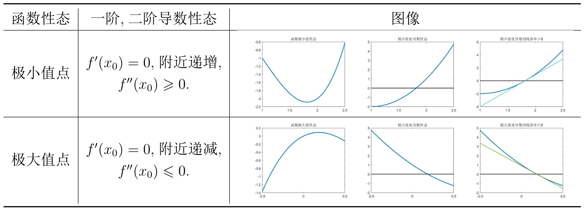
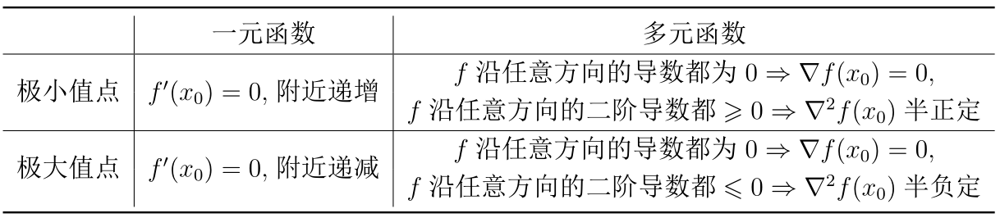
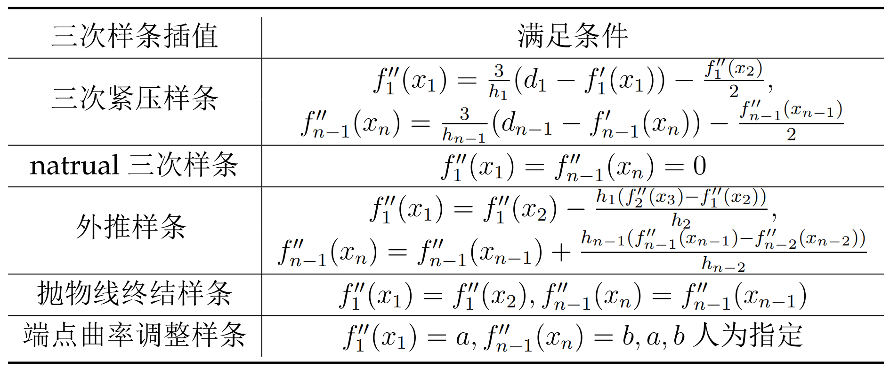
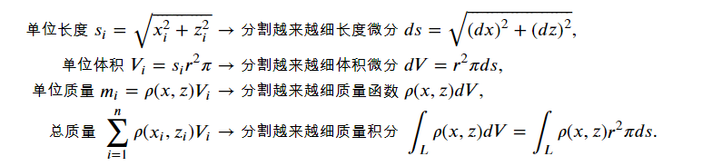

## 高等数学与数值计算


本课时介绍了三种数学方法用于解决实际问题。并给出了用python进行数学建模的范例。以下是对本次内容的初略总结。

### 1 以微分初步知识及梯度下降法解决最优化问题

通过生成过程中控制成本的例子切入主题，求解生成多少台设备能使成本最低效益最大化。首先回顾关于求解极值点的基础。



<center>表 1 : 极值点函导数性态</center>

**驻点**：一阶导数为0的点

**拐点**：函数凹凸性发生变化的点


使用python自带的`sympy`求解极值。

```python
from sympy import *

n = symbols('n')                  # 声明变量
y = 1250*(2-exp(-(n-5000)**2))    # 函数表达式

func1 = diff(y,n) # 求导数     api：diff(f, *symbols, **kwargs)

stag = solve(func1, n) #   计算驻点   api：solve(f, *symbols, **flags)

func2 = diff(y, n, 2) # 求导数     计算二阶导数

# 计算驻点的二阶导数值，验证正负
print(func2.evalf(subs = {n:5000}))  
# func2.evalf(
#    n=15,
#    subs=None,   # 为字典类型
#    maxn=100,    #   Allow a maximum temporary working precision of maxn digits.
#    chop=False,  # 指定如何用精确的零替换子结果中的微小实部或虚部。
#    strict=False, # 如果执行失败，则给出最大可利用精度，并抛出"PrecisionExhausted"
#    quad=None,    # 选择数值求积的算法，采用Tanh-sinh积分法。对振荡无限区间上的积分，尝试' ' quad='osc' '
#    verbose=False, # 打印调试信息
# )
```




验证一个对称矩阵是否正(负)定只需要验证其所有特征值是否大(小)于0。

**判断矩阵是否正定的方法有（部分）**：

- 对角矩阵$diag(d_{1},d_{2},...,d{n})$为正定的充要条件是$d_{i}>0, i=1,2,3,...,n$.
- 堆成矩阵$A$为正定的充要条件是它的特征值全大于零。半正定为全$>=0$
- $|A|>0$


### 2 以插值知识解决数据处理问题

本节以宽带运营商不同时间点的网速情况为依据，模拟出连续时间的网速曲线。

**定义【插值】**设$(x_{i},y_i),i=1,2,...,n是R^2上的n个点，f:\mathbf{R} \to \mathbf{R}是一条满足y_i=f(x_i),i=1,2,\cdots,n的函数曲线，则f称为(x_i,y_i)的插值曲线 $

**定义【三次样条插值】** 设 $(x_i,y_i),i=1,2,\cdots,n$ 是 $\mathbf{R}^2$ 上的 $n$ 个点$,$ 其三次样条插值函数为

​	$$ f_i(t)=s_{i,0}+s_{i,1}t+s_{i,2}t^2+s_{i,3}t^3,i=1,2,\cdots, n-1, $$ 

满足
$$ f_{i}(x_i)&=y_i,i=1,2,\cdots,n-1,f_{n-1}(x_{n})=y_{n}\\
 	 f_{i}(x_{i+1})&=y_{i+1}(x_{i+1}),i=1,2,\cdots,n-2\\
 	f_{i}'(x_{i+1})&=y_{i+1}'(x_{i+1}),i=1,2,\cdots,n-2\\
 		f_{i}''(x_{i+1})&=y_{i+1}''(x_{i+1}),i=1,2,\cdots,n-2. $$




### 3 以积分知识解决工程问题

以抽水机对水桶中的水进行做工以及桥梁铁链质量估计为案例，来展开对定积分的近似求解。

利用python进行数值计算可得：

```python
from scipy import integrate # 已知函数表达式积分
from scipy import pi
def f(h):
    '''
    定义函数表达式.
    '''
    return 88.2 * pi * (5 - h)
v, err = integrate.quad(f, 0, 5) # 被积函数与积分区间
print('积分结果：', v, "， 误差为：", err) # 积分结果： 3463.605900582747 ， 误差为： 3.8453750190545164e-11
```




<center>微分表达式</center>

<strong> 定义4:[第一型曲线积分的计算方式] </strong> 
设平面曲线 $L$ 的参数方程为 $x=x(t),z=z(t),t\in [a,b],$ $\rho(x,z)$ 为定义在 $L$ 上的连续函数$,$ 则
	$$\displaystyle\int_{L}\rho(x,z)d s=\displaystyle\int_{a}^b\rho(x(t),z(t))\sqrt{(x'(t))^2+(z'(t))^2}d t.$$ 

我们代入问题给出的方程 $\rho(x,z),z(x)$ 以及铁环半径 $r=0.15 \mathrm{m}^3$ 即可得到铁链的总质量计算式为
$$11.79\displaystyle\int_{-300}^{300}\left(1+1.5^{2-3\cosh\frac{x}{300}-0.1\left(\frac{x}{50}\right)^2}\right)\sqrt{100+\sinh^2\dfrac{x}{300}}dx.$$

```python
# 第一型曲线积分
from scipy import sinh, cosh, sqrt
def f(x):
    index1 = (2 - 3 * cosh(x/300) - 0.1 * ((x/50)**2))
    return (1 + 1.5 ** index1) * sqrt(100 + (sinh(x/300))**2)

v, err = integrate.quad(f, -300, 300)
v * 11.79   # 输出为 98635.09908278256
```


### 实战项目

```tex
GitModel 公司对面试的实习生给出了这样一个问题 : 搜集  1950∼2020  年间美国人口数据 ,  猜测其满足的函数关系 ,  并综合数据预测美国  2030  年的人口数.

公司希望实习生就以下的开放性问题给出自己的想法，公司要求实习生提交预测的思路 ,  模型 ,  算法以及结果.

面试官给出了如下提示 : 预测值与真实值存在误差 ,  该问题如何转化为可用上述所学的知识解决的问题呢?
```

(1) 从你的数据来看,,你猜想美国人口与时间的关系应该满足怎样的函数关系((线性,,二次,,或是其他))? 这样的函数关系你如何确定? 又怎么衡量这个函数具有良好的预测效果?[请在下方Markdown方格中写下你的答案]

> 


(2)也许你可以尝试用不同的函数关系进行预测,,比较一下是哪种函数更贴合数据,,但是,,越贴合数据的函数是否真的预测的结果越可信?你可以查阅资料去了解该问题,,但我们更希望你能解释这个问题的内在原理,,如果能给出相应的解决方法那就更好了![请在下方Markdown方格中写下你的答案]

> 


